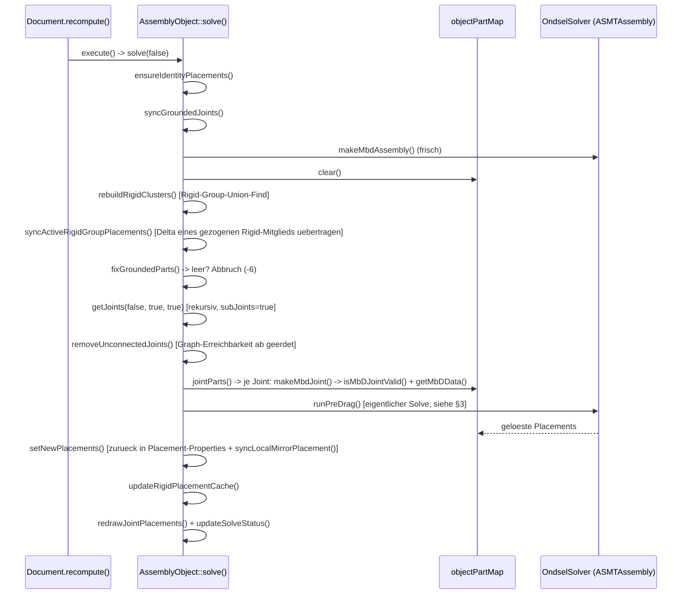
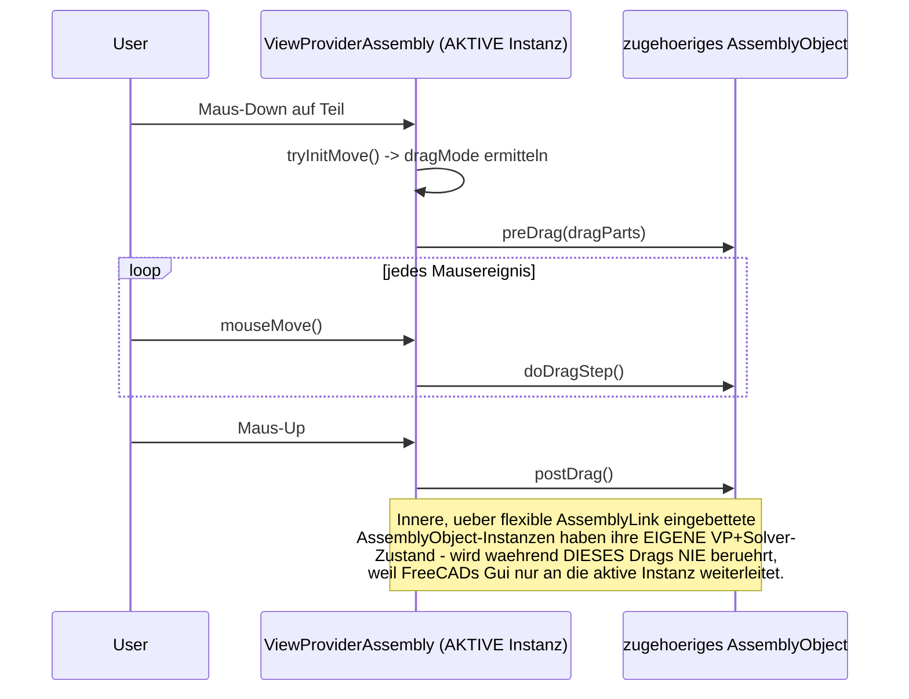
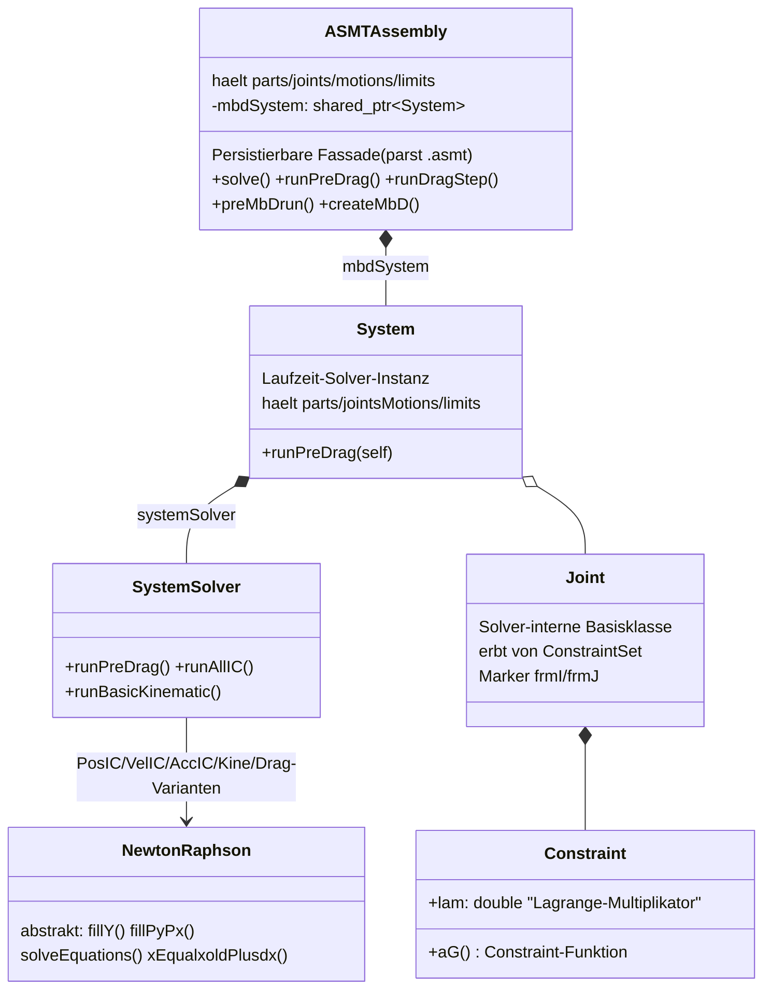

# Assembly-Modul: Architektur-Referenz

**Lebendiges Nachschlagewerk, keine Chronik.** Fasst zusammen, WIE das Assembly-Modul heute
funktioniert und wo die "Adressieren statt Kopieren"-Migration steht. Bei jeder Session, die den
Ist-Zustand ändert, wird dieses Dokument aktualisiert (nicht nur angehängt).

Für die Entstehungsgeschichte, jeden einzelnen Bug/Fix mit Herleitung, Testprotokollen und
Live-Verifikationen: **[JOURNAL.md](JOURNAL.md)** (chronologisch, wird weiter nur ergänzt).

**Der eine Satz, der alles andere hier erklärt:** über eine verschachtelte flexible Baugruppe
existieren für dasselbe physische Teil zwei parallele Identitäten - das ECHTE Objekt (tief in der
Unterbaugruppe, ggf. eigenes Dokument) und seine LOKALE Spiegelkopie (`App::Link`, von der alten
Kopier-Pipeline erzeugt/synchronisiert). Die **Darstellung** (was der Nutzer im Baum sieht,
anklickt, zieht) arbeitet mit den Spiegelkopien; der eigentliche **Solve** arbeitet zunehmend
direkt mit den echten Objekten (`canonicalizeForMbD()`, siehe §4). Fast jeder in §6 aufgeführte
Bug ist eine Variante von "Code X kennt nur eine der beiden Identitäten, Code Y nur die andere".

---

## 1. Akteure

```mermaid
classDiagram
    class AssemblyObject {
        App::Part Unterklasse
        +mbdAssembly
        +objectPartMap
        +solve(enableRedo)
        +preDrag() doDragStep() postDrag()
        +getJoints(delBadJoints, subJoints, verboseLog)
        +canonicalizeForMbD(obj) DocumentObject*
        +getGroundedParts()
        +syncGroundedJoints()
    }
    class AssemblyLink {
        App::Part Unterklasse, KEIN eigener Solver
        +Rigid bool
        +LinkedObject PropertyXLink
        +objLinkMap
        +updateContents()
        +synchronizeComponents()
        +synchronizeJoints() "KOPIERT noch"
        +findLocalAncestor()
        +getLinkedAssembly() AssemblyObject*
    }
    class Joint {
        JointObject.py Proxy, EINE Klasse fuer alle Typen
        +Reference1 PropertyXLinkSub
        +Reference2 PropertyXLinkSub
        +JointType steuert Solver-Verhalten
    }
    class GroundedJoint {
        JointObject.py Proxy
        +ObjectToGround PropertyLinkGlobal
        setzt Placement.ReadOnly
    }
    class RigidGroupJoint {
        JointObject.py Proxy
        +ObjectsToRigidGroup PropertyLinkListGlobal
        Bündel, kein Reference1/2
    }
    class ViewProviderAssembly {
        eine Instanz pro AssemblyObject
        +canDragObjectIn3d()
        +hasRealObject() "eigener Patch"
    }
    class ASMTAssembly {
        OndselSolver-Fassade (3rdParty)
        persistierbar, parst .asmt
        +runPreDrag() +solve()
        kapselt System/SystemSolver, s. §3
    }

    AssemblyObject "1" *-- "0..*" AssemblyLink : Group
    AssemblyLink --> AssemblyObject : LinkedObject (verlinkt)
    AssemblyObject "1" *-- "0..*" Joint : JointGroup
    AssemblyLink "1" *-- "0..*" Joint : eigene JointGroup (KOPIEN)
    AssemblyObject --> GroundedJoint
    AssemblyObject --> RigidGroupJoint
    ViewProviderAssembly --> AssemblyObject : 1:1
    AssemblyObject --> ASMTAssembly : mbdAssembly
```

| Akteur | Datei | Kernrolle |
|---|---|---|
| `AssemblyObject` | `App/AssemblyObject.{h,cpp}` | Die Baugruppe selbst, Solver-Fassade. **Eine Instanz pro Verschachtelungsebene** - keine gemeinsame Solver-Welt über Ebenen hinweg (Kern des Nested-Problems). |
| `AssemblyLink` | `App/AssemblyLink.{h,cpp}` | Container, über den eine Baugruppe eine andere einbindet. `Rigid=true`: starr, keine eigene JointGroup. `Rigid=false`: flexibel, **kopiert** Joints der Quelle in eigene JointGroup - das ist die Kopier-Pipeline, um die sich alles dreht. |
| `Joint`/`GroundedJoint`/`RigidGroupJoint` | `JointObject.py` | Python-Proxy auf generischem `App::FeaturePython`. Nur `Joint` hat Sub-Pfad-fähige Referenzen (`PropertyXLinkSub`); `GroundedJoint`/`RigidGroupJoint` referenzieren nur ganze Objekte - dieselbe Adressierungslücke wie bei `Reference1`/`Reference2`. Siehe §1.1 für das Jointtyp-Modell im Detail. |
| `App::Link`/`PropertyXLinkSub` | FreeCAD-Kern | Bereits Sub-Pfad-fähig (`getSubValues()`, Punkt-getrennter String). Das Adressierungsformat existiert längst - der Assembly-Code nutzt es nur an einer Stelle konsequent (`getMovingPartFromSel()`). |
| `AssemblyUtils.{h,cpp}` | freie Funktionen | Übersetzer zwischen Referenz/Selektion und Objekt. `getMovingPartFromRef()` (ignoriert Sub-Pfad) vs. `getMovingPartFromSel()` (läuft Sub-Pfad ab, überspringt flexible Zwischen-Links) - **die zentrale Asymmetrie**, die die Migration schließt. |
| `ViewProviderAssembly` | `Gui/ViewProviderAssembly.cpp` | 1:1 pro `AssemblyObject`. Nur die *aktive* Instanz bekommt während eines Drags Mausereignisse - Grund, warum innere Baugruppen beim Ziehen nicht mitlösen. |
| `ASMTAssembly`/`System`/`SystemSolver` | `3rdParty/OndselSolver` | Der eigentliche Multibody-Solver, komplett unabhängig vom Assembly-Modul entwickelt (Ondsel). Siehe §3 für die volle Innenarchitektur. |

### 1.1 Jointtypen und Freiheitsgrade

Anders als der Name vermuten lässt, gibt es in `JointObject.py` **keine eigene Python-Klasse pro
Jointtyp** (kein `FixedJoint`, `RevoluteJoint`, ...) - nur **eine** generische `Joint`-Klasse
(`JointObject.py:183`), deren Verhalten über die Enum-Property `JointType`
(`JointTypes`-Liste, `JointObject.py:65-79`) gesteuert wird. Die eigentliche
Freiheitsgrad-Semantik entsteht erst C++-seitig in `AssemblyObject::makeMbdJointOfType()`
(`AssemblyObject.cpp:2269`), die je nach `JointType` die passende `ASMT*Joint`-Solver-Klasse
instanziiert:

| `JointType` | OndselSolver-Klasse | Freiheitsgrade |
|---|---|---|
| Fixed | `ASMTFixedJoint` | 0 (starre Verbindung) |
| Revolute | `ASMTRevoluteJoint` | 1 Rotation um Z-Achse der JCS |
| Cylindrical | `ASMTCylindricalJoint` | 1 Rotation + 1 Translation, beide um/entlang Z |
| Slider | `ASMTTranslationalJoint` | 1 Translation entlang Z |
| Ball | `ASMTSphericalJoint` | 3 Rotationen (Kugelgelenk), Position fest |
| Distance | je nach Geometriepaarung (`DistanceType`, s. `AssemblyUtils::getDistanceType()`) eine von `ASMTSphSphJoint`/`RevCylJoint`/`PlanarJoint`/`LineInPlaneJoint`/`PointInPlaneJoint`/`CylSphJoint` | hält (Mindest-)Abstand zwischen zwei Geometrieelementen |
| Parallel / Perpendicular | `ASMTParallelAxesJoint` / `ASMTPerpendicularJoint` | reine Orientierungs-Constraints, kein Positionsbezug |
| Angle | `ASMTAngleJoint` | fixierter Winkel zwischen zwei Achsen |
| RackPinion | `ASMTRackPinionJoint` | koppelt Rotation eines Revolute/Cylindrical mit Translation eines Sliders über `pitchRadius` |
| Screw | `ASMTScrewJoint` | koppelt Rotation+Translation am selben Teil über `pitch` (braucht einen zugehörigen Slider) |
| Gears / Belt | `ASMTGearJoint` (`radiusJ` bei Belt negiert) | koppelt zwei Rotations-DoF verschiedener Wellen |

`GroundedJoint`/`RigidGroupJoint` sind **keine** `JointType`-Varianten - sie haben kein
`Reference1`/`Reference2` und tauchen deshalb in `AssemblyObject::getJoints()` gar nicht auf
(siehe §4/§6): `GroundedJoint.ObjectToGround` setzt direkt `Placement.ReadOnly`, das ist die
Eigenschaft, an der `getGroundedParts()` "geerdet" tatsächlich festmacht - nicht die Existenz des
Joint-Objekts. `RigidGroupJoint.ObjectsToRigidGroup` bündelt mehrere Teile für
`AssemblyObject::rebuildRigidClusters()`.

---

## 2. Kernabläufe

### 2.1 `solve()` (normaler Recompute)



**Wichtig:** jede `AssemblyObject`-Instanz (auch jede verschachtelte Unterbaugruppe) durchläuft das
komplett unabhängig. Ein Dokument-Recompute löst sie alle nacheinander (Sub → Top → GrandTop) -
deshalb zeigt ein voller Recompute den Nested-Bug nicht, ein interaktiver Drag schon (2.2).

### 2.2 Interaktives Ziehen - warum nur die äußerste Baugruppe löst



### 2.3 Verschachteln: `AssemblyLink::updateContents()` (die Kopier-Pipeline)

```
updateContents()
 └─ synchronizeComponents()      // Kinder abgleichen, objLinkMap aufbauen
 └─ if Rigid:  ensureNoJointGroup()
    else:      synchronizeJoints()                          ⚠ KOPIERT noch
                └─ assembly->getJoints(false, false)         // NICHT rekursiv
                └─ pro Joint: doc->copyObject()               // echte neue Instanz!
                └─ handleJointReference(Reference1/2)
                    └─ objLinkMap-Lookup (direktes Kind)
                        └─ Fallback: findLocalAncestor()      // Enkelkind -> Wrapper+Praefix
```

`synchronizeJoints()` gleicht **positionsbasiert** ab (Joint-Index muss übereinstimmen) - fragil,
aber nicht die Haupt-Fehlerquelle. Die Haupt-Fehlerquelle: jede Verschachtelungsebene legt ein
**physisch eigenständiges** Joint-Dokumentobjekt an, statt das Original zu adressieren.

`synchronizeGroundedAndRigidJoints()` (`AssemblyLink.cpp:685`) sollte dasselbe zusätzlich für
`GroundedJoint`/`RigidGroupJoint` tun (die `synchronizeJoints()`s positionsbasiertes Verfahren
nicht erfasst, da ohne `Reference1/2`) - der Aufruf ist aber aktuell **auskommentiert**
(`AssemblyLink.cpp:344`), siehe §6.

### 2.4 GUI-Trigger-Kette (Command-Layer, außerhalb von `solve()` selbst)

- **Solve-Knopf** (`CommandSolveAssembly.py:60`): ruft `assembly.touch()` **vor**
  `assembly.recompute(True)` auf. Notwendig, weil `recompute(True)` allein nur "rekursiv über
  Abhängigkeiten neu berechnen" bedeutet, nicht "erzwingen" - ohne vorheriges `touch()` würde
  `execute()` (und damit `AssemblyObject::solve()`) übersprungen, wenn das Objekt nicht bereits
  als geändert markiert ist. Tastenkürzel `Z`.
- **Interaktives Ziehen** läuft komplett C++-seitig über `Gui/ViewProviderAssembly.cpp`, nicht
  über Python-Kommandos: `preDrag()`/`doDragStep()`/`postDrag()` rufen direkt die gleichnamigen
  `AssemblyObject`-Methoden auf (§2.2). Zulässigkeit wird VOR dem eigentlichen Drag geprüft -
  `collectMovableObjects()` verwirft ein Teil, wenn `AssemblyObject::isPartConnected()` es als
  Teil des bereits gelösten Constraint-Graphen erkennt ("No dragger for connected parts" -
  solche Teile bewegen sich nur über den Solver mit, nicht per freiem Ziehen);
  `canDragObjectIn3d()`/`hasRealObject()` entscheiden zusätzlich, ob ein über eine
  verschachtelte flexible `AssemblyLink` erreichtes Teil überhaupt als Kandidat zählt.
- **JCS-Vorschau beim Joint-Erstellen** ist ein komplett getrennter Pfad, kein Teil von "Solve":
  `ViewProviderJoint.showPreviewJCS()` (`JointObject.py:1163`), aufgerufen aus
  `TaskAssemblyCreateJoint.moveMouse()` (ebenfalls `JointObject.py:2417`, Klasse ab Zeile 1756)
  während des Joint-Erstellungsdialogs.

---

## 3. OndselSolver-Kern

Der eigentliche Multibody-Solver (`src/3rdParty/OndselSolver`, ~658 flache Dateien, keine
Unterordner) ist ein **von FreeCAD/Assembly komplett unabhängig entwickeltes** Projekt (Ondsel).
Er hat **keine eigene Architektur-Dokumentation** - nur ein 8-zeiliges README mit Verweis auf ein
externes Theorie-Repository (`github.com/Ondsel-Development/MbDTheory`); alles Weitere hier ist
aus Klassennamen/Code erschlossen.

### 3.1 Zwei Schichten



`ASMTAssembly` (`ASMTAssembly.h:32`) ist die **persistierbare, textformat-fähige Fassade** - das
ist auch der Typ, den `AssemblyObject::mbdAssembly` hält (`AssemblyObject.h:374`). Sie kapselt
intern ein zweites, "reines" Laufzeitobjekt: `System` (`System.h:35`), das wiederum einen
`SystemSolver` (`System.h:84`) hält - **das** ist die eigentliche numerische Maschine.

FreeCAD sieht in `AssemblyObject.cpp` ausschließlich `ASMT*`-Header, nie die "nackten"
`System`/`Part`/`Joint`/`Constraint`-Klassen direkt (Ausnahme: eine einzelne
`mbdSystem->jointsMotionsDo(...)`-Iteration, `AssemblyObject.cpp:555`, für Diagnosezwecke).

### 3.2 Lösungsverfahren

Klassischer **Lagrange-Multiplikator-DAE-Ansatz** (jede `Constraint` trägt ein `lam`-Feld,
`Constraint.h:61`) mit **Newton-Raphson-Iteration pro Solve-Phase**, getrennt nach
Position/Geschwindigkeit/Beschleunigung ("IC" = Initial Conditions):

| Phase | Löser-Klasse | Bedeutung |
|---|---|---|
| Position (Anfangsbedingung) | `PosICNewtonRaphson` | Der Fall, den FreeCAD bei jedem `solve()`/`runPreDrag()` tatsächlich nutzt |
| Geschwindigkeit | `VelICSolver` | linear, kein Newton-Raphson nötig |
| Beschleunigung | `AccICNewtonRaphson` | ebenfalls linear |
| Kinematischer Zeitschritt | `PosKineNewtonRaphson`/`AccKineNewtonRaphson` | für Simulationen (`generateSimulation()`) |
| Interaktives Ziehen | `PosICDragNewtonRaphson`/`PosICDragLimitNewtonRaphson` | inkl. Gelenklimits |

Ablauf für den Normalfall: `AssemblyObject::solve()` → `mbdAssembly->runPreDrag()`
(`ASMTAssembly.cpp:1334`) → **lazy Modellaufbau** über `preMbDrun()`/`createMbD()`
(`ASMTAssembly.cpp:1098`/`1222` - übersetzt die ASMT-Objektstruktur erst hier in echte
`Part`/`Joint`/`Constraint`-Laufzeitobjekte) → `System::runPreDrag()` (`System.cpp:114`, feuert
zunächst dieselbe `preMbDrun()`, dann eine Fixpunkt-Initialisierung) →
`SystemSolver::runPreDrag()` (`SystemSolver.cpp:169`: `initializeLocally/Globally()` +
`runPosIC()`).

Das lineare Teilsystem jeder Newton-Iteration wird über **sparse Gauß-Elimination mit
Pivotisierung** gelöst (`GESpMatParPvMarkoFast` u.ä.). Wird die Pivot-Matrix singulär
(`SingularMatrixError`), fängt `PosICNewtonRaphson::run()` (`PosICNewtonRaphson.cpp:23`) das ab
und **deaktiviert die redundanten Zwangsbedingungen automatisch** (`RedundantConstraint`,
ein Decorator um `Constraint`) statt den Solve scheitern zu lassen - das ist die Quelle der
"redundante Joints"-Meldung, die FreeCAD dem Nutzer anzeigt (`AssemblyObject.cpp:491-505`).

### 3.3 Kopplungs-Sequenz (Zusammenfassung von §2.1 + hier)

```
AssemblyObject::solve()
 └─ makeMbdAssembly()                          // leere ASMTAssembly
 └─ getJoints() + jointParts()                  // FreeCAD-Joints -> makeMbdJointOfType() -> ASMT*Joint, addJoint()
 └─ mbdAssembly->runPreDrag()
     └─ preMbDrun() -> createMbD()              // ASMT-Struktur -> echte MbD-Laufzeitobjekte (lazy!)
     └─ System::runPreDrag() -> SystemSolver::runPreDrag() -> runPosIC()  // Newton-Raphson
     └─ ExternalSystem::updateFromMbD()          // Rueckkanal
 └─ setNewPlacements()                          // geloeste Position/Rotation -> Base::Placement
```

`ExternalSystem` (`ExternalSystem.h:17-21`) kennt sowohl `asmtAssembly` als Rückkanal-Ziel als
auch (aktuell nur als **leerer Stub**, `ExternalSystem.cpp:26-28`) ein dediziertes
`freecadAssemblyObject`-Feld - die tatsächliche Kopplung läuft über den `asmtAssembly`-Zweig,
nicht über einen direkten FreeCAD↔MbD-Kanal.

---

## 4. Identitätsauflösung über Verschachtelungsebenen (das Herzstück der laufenden Arbeit)

Seit 2026-09-02 (10 Bugs, siehe [JOURNAL.md](JOURNAL.md)) wurde eine **parallele
Auflösungsschicht** gebaut, die - ohne die Kopier-Pipeline zu entfernen - trotzdem die korrekte
Identität über Verschachtelungsebenen hinweg findet:

```mermaid
graph TD
    A["canonicalizeForMbD(obj)"] -->|obj lokal in eigenem Group-Baum?| B[gefunden -> obj]
    A -->|nicht gefunden| C{"delegiere an jede eigene<br/>nicht-rigide Unterbaugruppe,<br/>deren Dokument zu obj passt"}
    C -->|rekursiv| A
    D["resolvePartForMbD(part)"] --> A
    E["getMovingPartFromSel(obj, sub)"] -->|laeuft Sub-Pfad Segment fuer Segment ab,<br/>ueberspringt flexible AssemblyLink-Stufen| F[echtes bewegliches Teil]
    G["getGroundedParts()"] -->|isReadOnly()-Flag lokal, plus Rigid-Cluster-Propagation| A
    H["getConnectedParts()/removeUnconnectedJoints()"] -->|Graph-Traversal ab geerdet, via resolvePartForMbD| A
    I["isPartConnected()"] -->|Drag-Zulaessigkeit, gleiche Traversal-Logik wie H| A
    J["syncLocalMirrorPlacement()"] -->|Kandidatenabgleich via| A
```

| Funktion | Datei | Rolle |
|---|---|---|
| `canonicalizeForMbD()` | `AssemblyObject.cpp:2997` | **Zentrale Wahrheitsquelle.** Rekursiv seit Bug 10 (2026-09-04) - delegiert an die tatsächlich zuständige verschachtelte Instanz, statt bei fehlgeschlagener lokaler Suche falsch "bereits kanonisch" zurückzugeben. |
| `resolvePartForMbD()` | `AssemblyObject.cpp:3070` | Kanonisiert konsequent für Solver-Zwecke (Bug 6) - liest den bei `getJoints()` hinterlegten `nestingPrefix`, löst `Reference1/2` adressierungsbewusst bis zum individuellen Teil auf (`resolveJointReference()`), kanonisiert das Ergebnis zusätzlich. |
| `getMovingPartFromSel()` | `AssemblyUtils.cpp:660` | Fix für `isLink()`-Bug bei verschachtelten flexiblen Links (Bug 1). Bleibt die einzige Funktion, die den vollen Sub-Pfad tatsächlich abläuft - für **Nutzer-Selektion**, nicht Joint-Referenzen. |
| `resolveJointReference()` | `AssemblyUtils.cpp:801` | Das Pendant zu `getMovingPartFromSel()` für **Joint-Referenzen**: baut die volle Adresse aus `nestingPrefix + Reference-Objekt + Sub-Pfad`, bricht defensiv (leeres Ergebnis) statt zu raten, wenn ein Segment nicht auflösbar ist. |
| `getGroundedParts()`/`fixGroundedParts()` | `AssemblyObject.cpp:1733`/`1869` | Was zählt als "geerdet" (`Placement.isReadOnly()`, plus Rigid-Cluster-Propagation) - siehe §6 für den 2026-09-09 entfernten, überaggressiven Rekursionsblock. |
| `getConnectedParts()`/`traverseAndMarkConnectedParts()`/`removeUnconnectedJoints()` | `AssemblyObject.cpp:2090`/`2073`/`1990` | Graph-Traversal ab den geerdeten Teilen (via `resolvePartForMbD()`), um Joints zu entfernen, die auf keinem Pfad zu einer Erdung liegen - inkl. Rigid-Cluster-Kanten. |
| `isPartConnected()` | `AssemblyObject.cpp:2163` | Dieselbe Traversal-Logik, aber für ein einzelnes Teil - Grundlage der Drag-Zulässigkeitsprüfung (§2.4). |
| `syncLocalMirrorPlacement()`/`collectLocalMirrorCandidates()` | `AssemblyObject.cpp:1252` | Hält lokale Spiegel-Kopien mit dem Solver-Ergebnis synchron (Bug 8) - bekannter Rest-Gap siehe §6. |
| `hasRealObject()` | `AssemblyObject.cpp`/`.h` | Erlaubt `canDragObjectIn3d()`, ein über verschachtelte flexible Links erreichtes Objekt zuzulassen (Bug 3). |

---

## 5. "Adressieren statt Kopieren" - Migrationsstatus

Ursprungskonzept: [JOURNAL.md](JOURNAL.md), Abschnitt "Fix-Konzept: Adressieren statt Kopieren".
Fünf Teilschritte, geplante Reihenfolge war bewusst inkrementell (jeder Schritt koexistiert mit der
alten Kopier-Pipeline, bis zuletzt):

| # | Schritt | Status | Beleg |
|---|---|---|---|
| 1 | `subJoints=true` + Diagnose-Erweiterung (Sub-Pfad aus `PropertyXLinkSub` extrahieren) | ✅ erledigt | `getJoints()` hat `nestingPrefix`-Parameter, `jointNestingPrefixMap` |
| 2 | `resolveJointReference()`-Äquivalent (gemeinsame Segment-Walk-Funktion) | ✅ erledigt (anderer Name) | `canonicalizeForMbD()`/`resolvePartForMbD()` übernehmen diese Rolle, 10 Bugs seit 2026-09-02 |
| 3 | `objectPartMap`/`getJoints()`-Rückgabetyp auf `(obj, subPath)` umstellen | ❌ **offen** | `objectPartMap` schlüsselt weiterhin nur über `DocumentObject*` - `canonicalizeForMbD()` arbeitet als Band-Aid *davor*, ersetzt den Schlüsseltyp selbst nicht |
| 4 | Kopier-Pipeline entfernen (`synchronizeJoints()` → `ensureNoJointGroup()` auch im Flexibel-Zweig) | ❌ **offen** | `AssemblyLink::synchronizeJoints()` kopiert unverändert (nur der `subJoints`-Flag-Wert wurde zwischenzeitlich hin- und hergedreht, siehe `freecad-assembly-link-subjoints-revert.patch`) |
| 5 | Migration bestehender Projektdateien (alte Kopien in `JointGroup`) | ❌ offen, aber Plan steht | "Nichtstun"-Option dokumentiert: `ensureNoJointGroup()` räumt beim ersten Recompute automatisch auf |

**Einordnung:** Schritte 1-2 sind erledigt, allerdings als *parallele Auflösungsschicht* statt als
Ersatz - die eigentliche strukturelle Ursache (Schritt 4, die Kopier-Pipeline) lebt unverändert
weiter. Die bisherigen 10 Bugfixes sind wertvoll und live verifiziert, aber **Reparaturen um das
Kopieren herum**, keine Beseitigung. Das im Originalkonzept dokumentierte Aufwands-/Risiko-Kalkül
(Abschnitt 5 dort) gilt unverändert: Schritt 3+4 sind die größte verbleibende Einzeländerung,
sollten aber jetzt - mit Schritt 1-2 als erprobtem Fundament - risikoärmer sein als ursprünglich
eingeschätzt.

**Nicht zu verwechseln:** der 2026-09-09-Fix an `getGroundedParts()` (§6, "Grounding-Leak") ist
ein **eigenständiges, angrenzendes** Problem (wann gilt ein Teil als geerdet), keiner dieser 5
Migrationsschritte selbst.

---

## 6. Bekannte offene Lücken

- **Grounding-Leak-Fix (2026-09-09):** die rekursive Übernahme der Erdung einer verschachtelten
  Unterbaugruppe (früher in `getGroundedParts()`) wurde **ersatzlos entfernt** - sie hatte zwei
  live reproduzierte Regressionen verursacht (eine frisch eingefügte, unverbundene flexible
  Unterbaugruppe fror grundlos komplett ein; eine durch Löschen des inneren Joints entstandene,
  vom äußeren Anschlusspunkt getrennte Insel blieb trotzdem fixiert). Reine
  Joint-Graph-Erreichbarkeit (die dank `getJoints()`s eigener `subJoints`-Rekursion bereits echte,
  tief verschachtelte Joint-Ketten korrekt einschließt) trägt jetzt allein. **Bekanntes,
  akzeptiertes Risiko:** die ursprüngliche Motivation dieses Blocks (ein 2+ Ebenen tief NUR über
  sein eigenes `GroundedJoint` erreichbares Teil, dessen `isReadOnly()`-Flag die alte
  Kopier-Pipeline nachweislich nur 1 Ebene tief synchronisiert) könnte dadurch wieder auftreten -
  noch nicht erneut getestet. **Aufräum-Punkt:** `reachabilityJoints`/
  `reachableFromLocalGrounding` (`AssemblyObject.cpp:1809-1816`) werden weiterhin berechnet, aber
  seither nirgends mehr gelesen - toter Code, ein kompletter `getJoints()`-Rekursionsaufruf pro
  `getGroundedParts()`-Aufruf ohne Nutzen.
- **RigidGroupJoint ("Starre Verbindung") über eine Baugruppengrenze hinweg wirkungslos:** zwei
  Teilursachen bereits gefixt (2026-09-09) - `ObjectsToRigidGroup` fehlte der
  `PropertyLinkListGlobal`-Scope (Referenzen über die `AssemblyLink`-Gruppengrenze wurden von
  FreeCAD als "out of scope" verworfen, analog zu `GroundedJoint.ObjectToGround`, das das bereits
  richtig macht); `rebuildRigidClusters()` verglich rohe statt kanonisierte Objekte. **Dritte,
  noch offene Blockade:** `getRigidGroups()` (`AssemblyObject.cpp:1625`) verwirft eine Rigid-Gruppe
  komplett, sobald nicht ALLE Mitglieder über `hasObject()` als direkte, lokale Komponenten
  DESSELBEN Assembly gelten - Spiegelkopien einer verschachtelten Unterbaugruppe (`SubLink.Group`-
  Kinder) fallen durch dieses Raster. Zwei Lösungsrichtungen ungeklärt: `hasObject()`-Prüfung um
  eine kanonisierte, verschachtelungsbewusste Variante ergänzen, oder den aktuell deaktivierten
  `synchronizeGroundedAndRigidJoints()`-Copy-Mechanismus reaktivieren (setzt voraus, dessen
  Reentrancy-/Absturz-Ursache zuerst zu lösen, siehe nächster Punkt).
- **`synchronizeGroundedAndRigidJoints()`/`mapToLocalComponent()`:** eigener Patch, Aufruf aktuell
  auskommentiert (`AssemblyLink.cpp:344`) - hatte in der Vergangenheit einen echten Absturz
  verursacht (Reentrancy während `updateContents()` beim Löschen einer verschachtelten
  `AssemblyLink`, Log zeigte hunderte abwechselnde "alreadyMirrored"/"Could not map"-Zeilen kurz
  vor dem Crash). Nicht reaktivieren, ohne die Reentrancy-Gefahr erneut zu bewerten.
- **Positionsbasierter Joint-Abgleich in `synchronizeJoints()`:** fragil (Index-Kopplung statt
  stabiler Identität), aber irrelevant, sobald Migrationsschritt 4 die Funktion entfernt.
- **Unbedingte Debug-Logs in Hot Paths:** `getJoints()` (`AssemblyObject.cpp:1470,1493`),
  `getMovingPartFromSel()` (`AssemblyUtils.cpp:677ff.`) und `isPartConnected()`
  (`AssemblyObject.cpp:2202ff.`) rufen `Base::Console().log(...)` **unbedingt** auf (nicht hinter
  `verboseLog`), obwohl an anderer Stelle im selben Code explizit dokumentiert ist, dass genau das
  wegen der Kosten während interaktivem Dragging vermieden werden sollte (der Report-View-Pfad
  ist pro Aufruf nicht billig) - als "temporär, zur Live-Diagnose" markiert, nie entfernt.
- **Dangling `patches/README.md`-Verweise:** `AssemblyLink.cpp` verweist an mehreren Stellen
  (u.a. Zeilen 342, 673, 871, 941) auf `patches/README.md` für die
  GroundedJoint/RigidGroupJoint-Verschwinden-Historie - diese Datei **existiert nicht** im Repo.
  Weder nachgezogen noch die Kommentare umgebogen; die referenzierten Inhalte sind (soweit
  bekannt) nur in diesem Dokument bzw. in `JOURNAL.md` erfasst.
- **"BoxA springt komisch" (2026-09-09, offen):** beim Testen des Grounding-Leak-Fixes in einem
  frischen Dokument (Sub per Insert Link eingefügt, noch kein Joint angelegt) war BoxB korrekt
  beweglich, BoxA zeigte aber ein noch nicht reproduziertes, ungewöhnliches Drag-Verhalten -
  nächster Untersuchungsschritt, siehe Projekt-Memory `reference-nested-grounding-leak-bugfix.md`.
- **Unabhängig geöffnete Zwischenebene synchronisiert nicht:** `Top`s eigene lokale Spiegel-Kopie
  bleibt nach einem `GrandTop`-only-Solve unsynchronisiert, wenn `Top` separat vom übergeordneten
  `GrandTop` geöffnet/angezeigt wird. Für `GrandTop`s eigene 3D-Ansicht irrelevant. Nicht verfolgt,
  bis ein konkreter Anwendungsfall gemeldet wird.

---

## 7. Glossar

| Begriff | Bedeutung |
|---|---|
| **MbD** | Multi-body Dynamics - der Ondsel-Solver-Kern (Newton-Raphson), löst starre Körper + Gelenke |
| **ASMT** | "Assembly Simulation Markup Tool" (vermutlich) - Ondsels textbasiertes Austauschformat (`.asmt`) samt der `ASMT*`-Klassenfassade, über die FreeCAD den Solver befüllt |
| **`System`/`SystemSolver`** | Die "nackte" numerische Laufzeit-Maschine hinter `ASMTAssembly` - Gleichungssystemaufbau, Newton-Raphson-Iteration, Integration |
| **Lagrange-Multiplikator** | Jede Zwangsbedingung (`Constraint`) trägt eine Variable `lam` - Standardansatz für DAE-Mehrkörpersysteme |
| **Redundante Constraint** | Vom Solver bei singulärer Pivot-Matrix automatisch erkannte, linear abhängige Zwangsbedingung - wird deaktiviert statt den Solve scheitern zu lassen |
| **Nested/verschachtelt** | Eine `AssemblyObject`-Instanz, die über eine flexible `AssemblyLink` in eine andere eingebettet ist - beliebig tief |
| **Kanonisch/kanonisieren** | Das *eine*, tatsächlich zuständige Original-Objekt finden, unabhängig davon, über wie viele Verschachtelungsebenen/Spiegel-Kopien man es erreicht hat |
| **Spiegel-Kopie/lokaler Spiegel** | Ein `App::Link`/kopiertes `Joint`-Objekt, das eine `AssemblyLink` anlegt, um ein Objekt/Joint der Quell-Baugruppe lokal verfügbar zu machen |
| **Adressieren statt Kopieren** | Leitprinzip: statt physische Kopien zu erzeugen und synchron zu halten, das Original über einen Pfad (`AssemblyLink1.AssemblyLink2.Objekt`) direkt referenzieren |
| **`objectPartMap`** | `AssemblyObject`-interne Zuordnung FreeCAD-Objekt → starrer MbD-Solver-Körper, aktuell nur über `DocumentObject*` geschlüsselt |
| **Rigid-Cluster** | Menge von Teilen, die per `RigidGroupJoint` ("Starre Verbindung") als EIN starrer Körper behandelt werden (`rebuildRigidClusters()`/`rigidMembersByRep`) - unabhängig vom `Rigid`-Flag einer `AssemblyLink` |
| **Rigid vs. Flexibel** | `AssemblyLink.Rigid`: `true` = Unterbaugruppe verhält sich wie ein starres Teil (keine eigene JointGroup); `false` = intern beweglich, Joints werden gespiegelt (Quelle der Nested-Bugs) |
