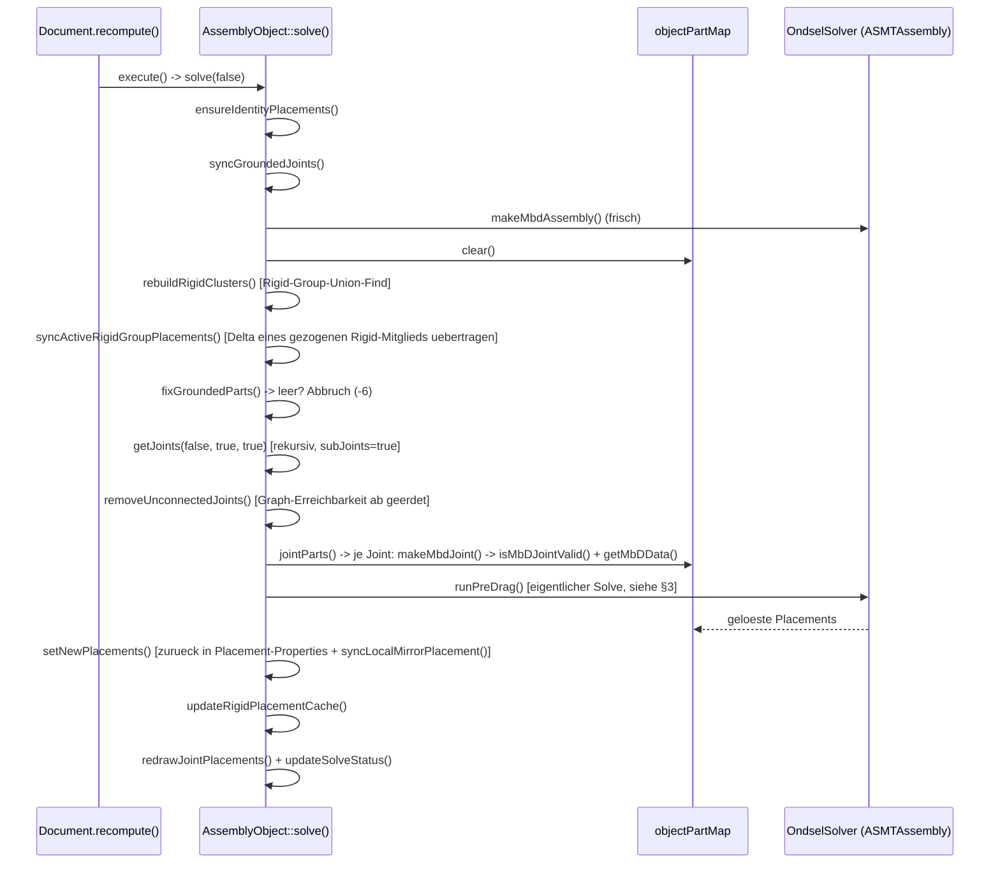
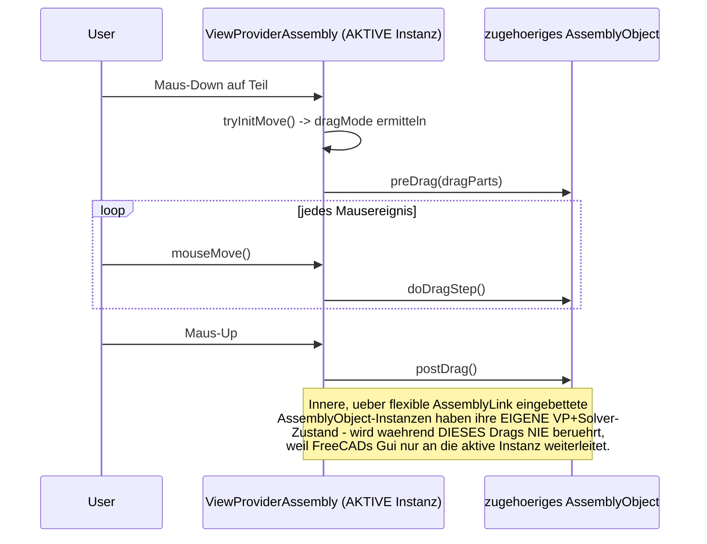
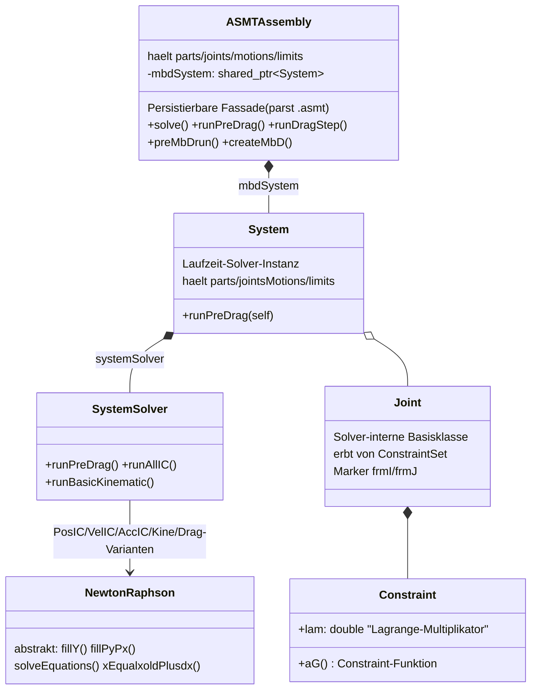

# Assembly-Modul: Architektur-Referenz

**Lebendiges Nachschlagewerk, keine Chronik.** Fasst zusammen, WIE das Assembly-Modul heute
funktioniert und wo die "Adressieren statt Kopieren"-Migration steht. Bei jeder Session, die den
Ist-Zustand ändert, wird dieses Dokument aktualisiert (nicht nur angehängt).

Für die Entstehungsgeschichte, jeden einzelnen Bug/Fix mit Herleitung, Testprotokollen und
Live-Verifikationen: **[JOURNAL.md](JOURNAL.md)** (chronologisch, wird weiter nur ergänzt).

**Der eine Satz, der alles andere hier erklärt:** über eine verschachtelte flexible Baugruppe
existieren für dasselbe physische Teil zwei parallele Identitäten - das ECHTE Objekt (tief in der
Unterbaugruppe, ggf. eigenes Dokument) und seine LOKALE Spiegelkopie (`App::Link`, von der alten
Kopier-Pipeline erzeugt/synchronisiert). Die **Darstellung** (was der Nutzer im Baum sieht,
anklickt, zieht) arbeitet mit den Spiegelkopien; der eigentliche **Solve** arbeitet zunehmend
direkt mit den echten Objekten (`canonicalizeForMbD()`, siehe §4). Fast jeder in §6 aufgeführte
Bug ist eine Variante von "Code X kennt nur eine der beiden Identitäten, Code Y nur die andere".

---

## 1. Akteure

```mermaid
classDiagram
    class AssemblyObject {
        App::Part Unterklasse
        +mbdAssembly
        +objectPartMap
        +solve(enableRedo)
        +preDrag() doDragStep() postDrag()
        +getJoints(delBadJoints, subJoints, verboseLog)
        +canonicalizeForMbD(obj) DocumentObject*
        +getGroundedParts()
        +syncGroundedJoints()
    }
    class AssemblyLink {
        App::Part Unterklasse, KEIN eigener Solver
        +Rigid bool
        +LinkedObject PropertyXLink
        +objLinkMap
        +updateContents()
        +synchronizeComponents()
        +synchronizeJoints() "KOPIERT noch"
        +findLocalAncestor()
        +getLinkedAssembly() AssemblyObject*
    }
    class Joint {
        JointObject.py Proxy, EINE Klasse fuer alle Typen
        +Reference1 PropertyXLinkSub
        +Reference2 PropertyXLinkSub
        +JointType steuert Solver-Verhalten
    }
    class GroundedJoint {
        JointObject.py Proxy
        +ObjectToGround PropertyLinkGlobal
        setzt Placement.ReadOnly
    }
    class RigidGroupJoint {
        JointObject.py Proxy
        +ObjectsToRigidGroup PropertyLinkListGlobal
        Bündel, kein Reference1/2
    }
    class ViewProviderAssembly {
        eine Instanz pro AssemblyObject
        +canDragObjectIn3d()
        +hasRealObject() "eigener Patch"
    }
    class ASMTAssembly {
        OndselSolver-Fassade (3rdParty)
        persistierbar, parst .asmt
        +runPreDrag() +solve()
        kapselt System/SystemSolver, s. §3
    }

    AssemblyObject "1" *-- "0..*" AssemblyLink : Group
    AssemblyLink --> AssemblyObject : LinkedObject (verlinkt)
    AssemblyObject "1" *-- "0..*" Joint : JointGroup
    AssemblyLink "1" *-- "0..*" Joint : eigene JointGroup (KOPIEN)
    AssemblyObject --> GroundedJoint
    AssemblyObject --> RigidGroupJoint
    ViewProviderAssembly --> AssemblyObject : 1:1
    AssemblyObject --> ASMTAssembly : mbdAssembly
```

| Akteur | Datei | Kernrolle |
|---|---|---|
| `AssemblyObject` | `App/AssemblyObject.{h,cpp}` | Die Baugruppe selbst, Solver-Fassade. **Eine Instanz pro Verschachtelungsebene** - keine gemeinsame Solver-Welt über Ebenen hinweg (Kern des Nested-Problems). |
| `AssemblyLink` | `App/AssemblyLink.{h,cpp}` | Container, über den eine Baugruppe eine andere einbindet. `Rigid=true`: starr, keine eigene JointGroup. `Rigid=false`: flexibel, **kopiert** Joints der Quelle in eigene JointGroup - das ist die Kopier-Pipeline, um die sich alles dreht. |
| `Joint`/`GroundedJoint`/`RigidGroupJoint` | `JointObject.py` | Python-Proxy auf generischem `App::FeaturePython`. Nur `Joint` hat Sub-Pfad-fähige Referenzen (`PropertyXLinkSub`); `GroundedJoint`/`RigidGroupJoint` referenzieren nur ganze Objekte - dieselbe Adressierungslücke wie bei `Reference1`/`Reference2`. Siehe §1.1 für das Jointtyp-Modell im Detail. |
| `App::Link`/`PropertyXLinkSub` | FreeCAD-Kern | Bereits Sub-Pfad-fähig (`getSubValues()`, Punkt-getrennter String). Das Adressierungsformat existiert längst - der Assembly-Code nutzt es nur an einer Stelle konsequent (`getMovingPartFromSel()`). |
| `AssemblyUtils.{h,cpp}` | freie Funktionen | Übersetzer zwischen Referenz/Selektion und Objekt. `getMovingPartFromRef()` (ignoriert Sub-Pfad) vs. `getMovingPartFromSel()` (läuft Sub-Pfad ab, überspringt flexible Zwischen-Links) - **die zentrale Asymmetrie**, die die Migration schließt. |
| `ViewProviderAssembly` | `Gui/ViewProviderAssembly.cpp` | 1:1 pro `AssemblyObject`. Nur die *aktive* Instanz bekommt während eines Drags Mausereignisse - Grund, warum innere Baugruppen beim Ziehen nicht mitlösen. |
| `ASMTAssembly`/`System`/`SystemSolver` | `3rdParty/OndselSolver` | Der eigentliche Multibody-Solver, komplett unabhängig vom Assembly-Modul entwickelt (Ondsel). Siehe §3 für die volle Innenarchitektur. |

### 1.1 Jointtypen und Freiheitsgrade

Anders als der Name vermuten lässt, gibt es in `JointObject.py` **keine eigene Python-Klasse pro
Jointtyp** (kein `FixedJoint`, `RevoluteJoint`, ...) - nur **eine** generische `Joint`-Klasse
(`JointObject.py:183`), deren Verhalten über die Enum-Property `JointType`
(`JointTypes`-Liste, `JointObject.py:65-79`) gesteuert wird. Die eigentliche
Freiheitsgrad-Semantik entsteht erst C++-seitig in `AssemblyObject::makeMbdJointOfType()`
(`AssemblyObject.cpp:2269`), die je nach `JointType` die passende `ASMT*Joint`-Solver-Klasse
instanziiert:

| `JointType` | OndselSolver-Klasse | Freiheitsgrade |
|---|---|---|
| Fixed | `ASMTFixedJoint` | 0 (starre Verbindung) |
| Revolute | `ASMTRevoluteJoint` | 1 Rotation um Z-Achse der JCS |
| Cylindrical | `ASMTCylindricalJoint` | 1 Rotation + 1 Translation, beide um/entlang Z |
| Slider | `ASMTTranslationalJoint` | 1 Translation entlang Z |
| Ball | `ASMTSphericalJoint` | 3 Rotationen (Kugelgelenk), Position fest |
| Distance | je nach Geometriepaarung (`DistanceType`, s. `AssemblyUtils::getDistanceType()`) eine von `ASMTSphSphJoint`/`RevCylJoint`/`PlanarJoint`/`LineInPlaneJoint`/`PointInPlaneJoint`/`CylSphJoint` | hält (Mindest-)Abstand zwischen zwei Geometrieelementen |
| Parallel / Perpendicular | `ASMTParallelAxesJoint` / `ASMTPerpendicularJoint` | reine Orientierungs-Constraints, kein Positionsbezug |
| Angle | `ASMTAngleJoint` | fixierter Winkel zwischen zwei Achsen |
| RackPinion | `ASMTRackPinionJoint` | koppelt Rotation eines Revolute/Cylindrical mit Translation eines Sliders über `pitchRadius` |
| Screw | `ASMTScrewJoint` | koppelt Rotation+Translation am selben Teil über `pitch` (braucht einen zugehörigen Slider) |
| Gears / Belt | `ASMTGearJoint` (`radiusJ` bei Belt negiert) | koppelt zwei Rotations-DoF verschiedener Wellen |

`GroundedJoint`/`RigidGroupJoint` sind **keine** `JointType`-Varianten - sie haben kein
`Reference1`/`Reference2` und tauchen deshalb in `AssemblyObject::getJoints()` gar nicht auf
(siehe §4/§6): `GroundedJoint.ObjectToGround` setzt direkt `Placement.ReadOnly`, das ist die
Eigenschaft, an der `getGroundedParts()` "geerdet" tatsächlich festmacht - nicht die Existenz des
Joint-Objekts. `RigidGroupJoint.ObjectsToRigidGroup` bündelt mehrere Teile für
`AssemblyObject::rebuildRigidClusters()`.

---

## 2. Kernabläufe

### 2.1 `solve()` (normaler Recompute)



**Wichtig:** jede `AssemblyObject`-Instanz (auch jede verschachtelte Unterbaugruppe) durchläuft das
komplett unabhängig. Ein Dokument-Recompute löst sie alle nacheinander (Sub → Top → GrandTop) -
deshalb zeigt ein voller Recompute den Nested-Bug nicht, ein interaktiver Drag schon (2.2).

### 2.1a Erdung: fixierter Anker statt Live-Placement (2026-09-13)

`fixGroundedParts()` liest für den Zielwert eines geerdeten Teils bewusst weiterhin bei **jedem**
`solve()` das aktuelle `Placement` live ein (unverändert seit jeher) - das Problem liegt nicht im
Lesen selbst, sondern darin, dass OndselSolvers Redundanz-Elimination (generische Gauss-
Elimination mit Voll-Pivotisierung, `GESpMatFullPvPosIC.cpp::doPivoting()` - wählt rein nach
Betragsgröße des Pivot-Elements, kennt keine Objekt-Identität) auch die Erdungs-eigenen
Constraints als redundant verwerfen kann, wenn andere `Fixed`-Joints im System nur *annähernd*
(nicht exakt) konsistent sind. Der vorgegebene Zielwert wird dann schlicht nicht durchgesetzt -
live reproduziert an einer realen CNC3018-Baugruppe (mehrere Fixed-Joints an ein geerdetes
Basisteil): das verbundene Teile-Cluster blieb als Ganzes um die fehlenden Freiheitsgrade frei,
landete nach jedem `solve()`-Aufruf an einer anderen, nur "zufällig" gültigen Position - ganz ohne
Fehlermeldung, da der Solver selbst erfolgreich konvergierte.

**Fix** (`computeGroundCorrection()`, aufgerufen von `setNewPlacements()`): `fixGroundedParts()`
merkt sich zusätzlich Objekt und vorgegebenen Zielwert des einen (per Definition genau einen)
explizit per `GroundedJoint` geerdeten Teils dieser Ebene (`groundedTargetObj`/`groundedTargetPlc`,
`AssemblyObject.h`). Nach dem eigentlichen Solve wird die *tatsächlich* gelöste Placement dieses
Teils gegen den vorgegebenen Wert verglichen; die Differenz ist eine einzige starre
Koordinatentransformation, die `setNewPlacements()` auf **alle** gelösten Placements dieser Ebene
anwendet (nicht nur auf das geerdete Teil selbst) - ändert dadurch keine vom Solver bereits korrekt
berechnete Relativgeometrie zwischen Teilen, biegt nur das Gesamtergebnis so zurecht, dass das
geerdete Teil exakt an seinem vorgegebenen Platz landet. Kein persistenter Zustand nötig: da jeder
`solve()`-Durchlauf die Erdung exakt zurückbiegt, liest der nächste Durchlauf denselben (jetzt
korrekten) Wert wieder als sein eigenes Ziel ein - ein stabiler Fixpunkt. Betrifft ausschließlich
`AssemblyObject.cpp`/`.h`, der Solver-Kern (OndselSolver) bleibt unangetastet.

**Bewusst nicht mit behoben:** die davon unabhängige Kaltstart-Konvergenzempfindlichkeit von Newton
bei mehreren gleichzeitigen `Fixed`-Joints auf demselben Basisteil (ein frisch geöffnetes Dokument
mit weit von der Loesung entfernten Start-Placements kann trotz dieses Fixes mit
`MbD: No convergence` scheitern, wo ein schrittweiser Aufbau mit Zwischen-Solves konvergiert) -
separates, größeres Numerik-Thema.

### 2.1b Joint-Erstellung: fragile `Type`-Property statt echter Typprüfung (2026-09-13)

Zweiter, unabhängiger Fund an derselben Symptomklasse ("geerdetes Teil springt"): `JointObject.py`s
`matchJCS()`/`ensureUnconnectedIsSecondRef()` (aufgerufen aus dem in §2.4 beschriebenen, komplett
von `solve()` getrennten JCS-Vorschau-Pfad) entschieden bislang anhand von
`assembly.Type == "Assembly"`, ob überhaupt eine echte Verbindungsprüfung (`isPartConnected()`)
stattfinden soll. Diese `Type`-Property (geerbt von `App::Part`) wird aber **nur einmalig**,
hartkodiert in `CommandCreateAssembly.py` beim "Neue Baugruppe"-Befehl gesetzt - bei jeder
Baugruppe, die nicht über GENAU diesen Befehl entstand (z.B. ältere Dateien), bleibt sie ein leerer
String. Die Prüfung wurde dadurch fälschlich `False`, der Code fiel in einen Rückfallzweig, der
blind annimmt "das zweite ausgewählte Element ist immer das bewegliche Teil" - unabhängig von
echter Verbindung/Erdung. Traf in der Praxis abwechselnd das neu ausgewählte Teil UND das bereits
geerdete Teil (je nach Auswahlreihenfolge), im zweiten Fall wurde `Placement` eines bereits fest
geerdeten Teils direkt überschrieben.

**Fix:** alle 6 betroffenen Stellen ersetzen `assembly.Type == "Assembly"`/`!= "Assembly"` durch
`assembly is not None`/`assembly is None`. `assembly` kommt an jeder dieser Stellen aus
`getAssembly(joint)`, das laut eigener Definition (`isDerivedFrom("Assembly::AssemblyObject")`
beim `InList`-Durchlauf) ohnehin nur `None` oder ein echtes `AssemblyObject` zurückliefert - die
zusätzliche, aber fragile String-Prüfung war überflüssig und die eigentliche Fehlerquelle.

### 2.2 Interaktives Ziehen - warum nur die äußerste Baugruppe löst



### 2.3 Verschachteln: `AssemblyLink::updateContents()` (die Kopier-Pipeline)

```
updateContents()
 └─ synchronizeComponents()      // Kinder abgleichen, objLinkMap aufbauen
 └─ if Rigid:  ensureNoJointGroup()
    else:      synchronizeJoints()                          ⚠ KOPIERT noch
                └─ assembly->getJoints(false, false)         // NICHT rekursiv
                └─ pro Joint: doc->copyObject()               // echte neue Instanz!
                └─ handleJointReference(Reference1/2)
                    └─ objLinkMap-Lookup (direktes Kind)
                        └─ Fallback: findLocalAncestor()      // Enkelkind -> Wrapper+Praefix
```

`synchronizeJoints()` gleicht **positionsbasiert** ab (Joint-Index muss übereinstimmen) - fragil,
aber nicht die Haupt-Fehlerquelle. Die Haupt-Fehlerquelle: jede Verschachtelungsebene legt ein
**physisch eigenständiges** Joint-Dokumentobjekt an, statt das Original zu adressieren.

`synchronizeGroundedAndRigidJoints()` (`AssemblyLink.cpp:685`) sollte dasselbe zusätzlich für
`GroundedJoint`/`RigidGroupJoint` tun (die `synchronizeJoints()`s positionsbasiertes Verfahren
nicht erfasst, da ohne `Reference1/2`) - der Aufruf ist aber aktuell **auskommentiert**
(`AssemblyLink.cpp:344`), siehe §6.

### 2.4 GUI-Trigger-Kette (Command-Layer, außerhalb von `solve()` selbst)

- **Solve-Knopf** (`CommandSolveAssembly.py:60`): ruft `assembly.touch()` **vor**
  `assembly.recompute(True)` auf. Notwendig, weil `recompute(True)` allein nur "rekursiv über
  Abhängigkeiten neu berechnen" bedeutet, nicht "erzwingen" - ohne vorheriges `touch()` würde
  `execute()` (und damit `AssemblyObject::solve()`) übersprungen, wenn das Objekt nicht bereits
  als geändert markiert ist. Tastenkürzel `Z`.
- **Interaktives Ziehen** läuft komplett C++-seitig über `Gui/ViewProviderAssembly.cpp`, nicht
  über Python-Kommandos: `preDrag()`/`doDragStep()`/`postDrag()` rufen direkt die gleichnamigen
  `AssemblyObject`-Methoden auf (§2.2). Zulässigkeit wird VOR dem eigentlichen Drag geprüft -
  `collectMovableObjects()` verwirft ein Teil, wenn `AssemblyObject::isPartConnected()` es als
  Teil des bereits gelösten Constraint-Graphen erkennt ("No dragger for connected parts" -
  solche Teile bewegen sich nur über den Solver mit, nicht per freiem Ziehen);
  `canDragObjectIn3d()`/`hasRealObject()` entscheiden zusätzlich, ob ein über eine
  verschachtelte flexible `AssemblyLink` erreichtes Teil überhaupt als Kandidat zählt.
- **JCS-Vorschau beim Joint-Erstellen** ist ein komplett getrennter Pfad, kein Teil von "Solve":
  `ViewProviderJoint.showPreviewJCS()` (`JointObject.py:1163`), aufgerufen aus
  `TaskAssemblyCreateJoint.moveMouse()` (ebenfalls `JointObject.py:2417`, Klasse ab Zeile 1756)
  während des Joint-Erstellungsdialogs.

---

## 3. OndselSolver-Kern

Der eigentliche Multibody-Solver (`src/3rdParty/OndselSolver`, ~658 flache Dateien, keine
Unterordner) ist ein **von FreeCAD/Assembly komplett unabhängig entwickeltes** Projekt (Ondsel).
Er hat **keine eigene Architektur-Dokumentation** - nur ein 8-zeiliges README mit Verweis auf ein
externes Theorie-Repository (`github.com/Ondsel-Development/MbDTheory`); alles Weitere hier ist
aus Klassennamen/Code erschlossen.

### 3.1 Zwei Schichten



`ASMTAssembly` (`ASMTAssembly.h:32`) ist die **persistierbare, textformat-fähige Fassade** - das
ist auch der Typ, den `AssemblyObject::mbdAssembly` hält (`AssemblyObject.h:374`). Sie kapselt
intern ein zweites, "reines" Laufzeitobjekt: `System` (`System.h:35`), das wiederum einen
`SystemSolver` (`System.h:84`) hält - **das** ist die eigentliche numerische Maschine.

FreeCAD sieht in `AssemblyObject.cpp` ausschließlich `ASMT*`-Header, nie die "nackten"
`System`/`Part`/`Joint`/`Constraint`-Klassen direkt (Ausnahme: eine einzelne
`mbdSystem->jointsMotionsDo(...)`-Iteration, `AssemblyObject.cpp:555`, für Diagnosezwecke).

### 3.2 Lösungsverfahren

Klassischer **Lagrange-Multiplikator-DAE-Ansatz** (jede `Constraint` trägt ein `lam`-Feld,
`Constraint.h:61`) mit **Newton-Raphson-Iteration pro Solve-Phase**, getrennt nach
Position/Geschwindigkeit/Beschleunigung ("IC" = Initial Conditions):

| Phase | Löser-Klasse | Bedeutung |
|---|---|---|
| Position (Anfangsbedingung) | `PosICNewtonRaphson` | Der Fall, den FreeCAD bei jedem `solve()`/`runPreDrag()` tatsächlich nutzt |
| Geschwindigkeit | `VelICSolver` | linear, kein Newton-Raphson nötig |
| Beschleunigung | `AccICNewtonRaphson` | ebenfalls linear |
| Kinematischer Zeitschritt | `PosKineNewtonRaphson`/`AccKineNewtonRaphson` | für Simulationen (`generateSimulation()`) |
| Interaktives Ziehen | `PosICDragNewtonRaphson`/`PosICDragLimitNewtonRaphson` | inkl. Gelenklimits |

Ablauf für den Normalfall: `AssemblyObject::solve()` → `mbdAssembly->runPreDrag()`
(`ASMTAssembly.cpp:1334`) → **lazy Modellaufbau** über `preMbDrun()`/`createMbD()`
(`ASMTAssembly.cpp:1098`/`1222` - übersetzt die ASMT-Objektstruktur erst hier in echte
`Part`/`Joint`/`Constraint`-Laufzeitobjekte) → `System::runPreDrag()` (`System.cpp:114`, feuert
zunächst dieselbe `preMbDrun()`, dann eine Fixpunkt-Initialisierung) →
`SystemSolver::runPreDrag()` (`SystemSolver.cpp:169`: `initializeLocally/Globally()` +
`runPosIC()`).

Das lineare Teilsystem jeder Newton-Iteration wird über **sparse Gauß-Elimination mit
Pivotisierung** gelöst (`GESpMatParPvMarkoFast` u.ä.). Wird die Pivot-Matrix singulär
(`SingularMatrixError`), fängt `PosICNewtonRaphson::run()` (`PosICNewtonRaphson.cpp:23`) das ab
und **deaktiviert die redundanten Zwangsbedingungen automatisch** (`RedundantConstraint`,
ein Decorator um `Constraint`) statt den Solve scheitern zu lassen - das ist die Quelle der
"redundante Joints"-Meldung, die FreeCAD dem Nutzer anzeigt (`AssemblyObject.cpp:491-505`).

### 3.2a Interaktives Ziehen: Gewichtung statt harter Zwangserfüllung (2026-09-23)

Waehrend der Untersuchung eines BG22-Drag-Bugs (siehe Memory
`reference-bg22-drag-weighted-solver-mechanics.md`) wurde die Gewichtungsmechanik hinter
`PosICDragNewtonRaphson`/`PosICDragLimitNewtonRaphson` (§3.2-Tabelle) am Quellcode
nachvollzogen - das ist der Grund, warum ein interaktiver Zug ein eigentlich **hartes** Gelenk
(z.B. ein Fixed-Joint mit 0 Freiheitsgraden) sichtbar verletzen kann, obwohl ein regulaerer
`solve()` fuer dieselbe Topologie nachweislich immer exakt und stabil loest.

**Wer vergibt die Gewichte (`qsuWeights`, eine Diagonalmatrix ueber alle Positions-/
Rotations-Freiheitsgrade des gesamten Systems)?**

1. `AnyPosICNewtonRaphson::initializeGlobally()` (`AnyPosICNewtonRaphson.cpp:25-33`, Basisklasse
   von `PosICNewtonRaphson`/`PosICDragNewtonRaphson`/`PosICDragLimitNewtonRaphson`/
   `PosICKineNewtonRaphson` - siehe §3.2-Tabelle) laesst zunaechst JEDES `Item` (Part/Joint/
   Motion/Limit) ueber `item->fillqsuWeights(qsuWeights)` seinen EIGENEN Basiswert eintragen.
   Fuer einen `Part` (`Part.cpp:261-291`) ist das **massenproportional**: Gewicht = `1e6 * (m /
   mMax) + 1e3`, wobei `mMax` die groesste Masse im System ist - ein masseloses/Default-Teil
   landet nahe 1e3, das schwerste Teil nahe 1e6+1e3. Bei typischen CAD-Baugruppen mit
   aehnlichen/Default-Massen bleibt diese Verteilung NAHEZU GLEICHMAESSIG - das ist der Fall,
   den der normale `solve()` (`PosICNewtonRaphson`, KEINE eigene `initializeGlobally()`-
   Ueberschreibung) tatsaechlich nutzt.
2. `PosICDragNewtonRaphson::initializeGlobally()` (`PosICDragNewtonRaphson.cpp:23-39`) WIRFT DAS
   KOMPLETT UEBER BORD: setzt erst ALLE Gewichte (Position UND Rotation, alle Teile) pauschal
   auf `1e3`, dann fuer jedes Teil in der von `AssemblyObject::doDragStep()` uebergebenen
   `dragParts`-Liste NUR dessen Positions-Freiheitsgrade (x/y/z, NICHT die Rotation/Quaternion)
   auf `1e6`. Eine starre, binaere Verteilung - ein deutlich schaerferer kuenstlicher Kontrast
   als das, was reine Masse je erzeugen wuerde.
   ⚠ **Zu pruefen (noch offen, siehe Memory):** da NUR Position, nie Rotation angehoben wird,
   ist ein Drag-Modus, der ROTATION eines Teils erfordert (z.B. `DragMode::RotationOnPlane`
   fuer ein Revolute-Gelenk), potenziell anders/schwaecher gewichtet als ein reiner
   Translations-Drag - noch nicht am realen Fall verifiziert.
3. **Wer entscheidet, WELCHE Teile in `dragParts` landen** (also das hohe Gewicht bekommen)?
   Das ist reine FreeCAD-Seite, nicht der Solver: `AssemblyObject::preDrag()`/`doDragStep()`
   (`AssemblyObject.cpp`) bauen diese Liste aus dem, was `ViewProviderAssembly::findDragMode()`
   (§2.2) als bewegte Gruppe (Leitkoerper + `getDownstreamParts()`) ermittelt hat - der Solver
   selbst trifft dabei keine eigene Auswahl.

**Warum das ein hartes Gelenk sichtbar verletzen kann:** `AnyPosICNewtonRaphson::isConverged()`
(`AnyPosICNewtonRaphson.cpp:104`, von ALLEN vier PosIC-Varianten geteilt, also KEIN
Drag-spezifischer Fehler fuer sich genommen) prueft nur die SCHRITTGROESSE
(`dxNorms->at(iterNo) < dxTol`), NICHT direkt, wie klein der tatsaechliche Constraint-Fehler
(`fillPosICError()`, Teil des Residuums `y` in `fillY()`, `AnyPosICNewtonRaphson.cpp:42-54`)
noch ist. Bei der milden, massebasierten Gewichtung eines normalen `solve()` faellt das nicht
auf - das lineare Gleichungssystem bleibt gutartig genug, dass kleine Schritte auch kleine
Constraint-Fehler bedeuten. Bei der scharfen, kuenstlichen 1e3/1e6-Zweiteilung eines Drags kann
das Newton-Raphson-Verfahren "konvergieren" (kleine Schrittgroesse), OBWOHL ein Constraint wie
ein Fixed-Joint zwischen einem stark gewichteten (gezogenen) und einem normal gewichteten
(nicht gezogenen) Teil noch messbar verletzt ist - besonders wenn zusaetzlich ein Gelenklimit
aktiv wird (`PosICDragLimitNewtonRaphson`, eigene, ungewichtete Nachiteration, siehe §3.2).

**Praktische Konsequenz (siehe `todo-bg22-drag-fix-status.md`):** ein Teil, das NUR ueber ein
eigentlich hartes Gelenk an einem gezogenen Teil haengt, aber selbst NICHT in `dragParts` ist,
hat kein Gegengewicht, das die harte Bedingung numerisch durchsetzen wuerde - es kann drifen.
Der aktuell verfolgte Fix-Ansatz: konsequent ALLE Teile ausserhalb der bewegten Gruppe
(Leitkoerper + Downstream) ebenfalls mit dem hohen 1e6-Gewicht "anpinnen" (eigene, unveraenderte
Placement als Ziel), statt nur direkte Gelenk-Nachbarn - noch nicht implementiert/verifiziert.

### 3.3 Kopplungs-Sequenz (Zusammenfassung von §2.1 + hier)

```
AssemblyObject::solve()
 └─ makeMbdAssembly()                          // leere ASMTAssembly
 └─ getJoints() + jointParts()                  // FreeCAD-Joints -> makeMbdJointOfType() -> ASMT*Joint, addJoint()
 └─ mbdAssembly->runPreDrag()
     └─ preMbDrun() -> createMbD()              // ASMT-Struktur -> echte MbD-Laufzeitobjekte (lazy!)
     └─ System::runPreDrag() -> SystemSolver::runPreDrag() -> runPosIC()  // Newton-Raphson
     └─ ExternalSystem::updateFromMbD()          // Rueckkanal
 └─ setNewPlacements()                          // geloeste Position/Rotation -> Base::Placement
```

`ExternalSystem` (`ExternalSystem.h:17-21`) kennt sowohl `asmtAssembly` als Rückkanal-Ziel als
auch (aktuell nur als **leerer Stub**, `ExternalSystem.cpp:26-28`) ein dediziertes
`freecadAssemblyObject`-Feld - die tatsächliche Kopplung läuft über den `asmtAssembly`-Zweig,
nicht über einen direkten FreeCAD↔MbD-Kanal.

---

## 4. Identitätsauflösung über Verschachtelungsebenen (das Herzstück der laufenden Arbeit)

Seit 2026-09-02 (10 Bugs, siehe [JOURNAL.md](JOURNAL.md)) wurde eine **parallele
Auflösungsschicht** gebaut, die - ohne die Kopier-Pipeline zu entfernen - trotzdem die korrekte
Identität über Verschachtelungsebenen hinweg findet:

```mermaid
graph TD
    A["canonicalizeForMbD(obj)"] -->|obj lokal in eigenem Group-Baum?| B[gefunden -> obj]
    A -->|nicht gefunden| C{"delegiere an jede eigene<br/>nicht-rigide Unterbaugruppe,<br/>deren Dokument zu obj passt"}
    C -->|rekursiv| A
    D["resolvePartForMbD(part)"] --> A
    E["getMovingPartFromSel(obj, sub)"] -->|laeuft Sub-Pfad Segment fuer Segment ab,<br/>ueberspringt flexible AssemblyLink-Stufen| F[echtes bewegliches Teil]
    G["getGroundedParts()"] -->|isReadOnly()-Flag lokal, plus Rigid-Cluster-Propagation| A
    H["getConnectedParts()/removeUnconnectedJoints()"] -->|Graph-Traversal ab geerdet, via resolvePartForMbD| A
    I["isPartConnected()"] -->|Drag-Zulaessigkeit, gleiche Traversal-Logik wie H| A
    J["syncLocalMirrorPlacement()"] -->|Kandidatenabgleich via| A
```

| Funktion | Datei | Rolle |
|---|---|---|
| `canonicalizeForMbD()` | `AssemblyObject.cpp:3132` | **Zentrale Wahrheitsquelle.** Rekursiv seit Bug 10 (2026-09-04) - delegiert an die tatsächlich zuständige verschachtelte Instanz, statt bei fehlgeschlagener lokaler Suche falsch "bereits kanonisch" zurückzugeben. Seit dem Mehrfachinstanz-Fix (2026-09-14, siehe §4.1) löst sie jede Verschachtelungsebene **identitätsbasiert** über `AssemblyLink::objLinkMap`/`getSourceForMirror()` auf statt über einen Namensvergleich. |
| `resolvePartForMbD()` | `AssemblyObject.cpp:3238` | Kanonisiert konsequent für Solver-Zwecke (Bug 6) - erhält seit 2026-09-14 das `nestingPrefix` direkt vom Aufrufer als Parameter (nicht mehr aus einer separaten Member-Map, siehe §4.1), löst `Reference1/2` adressierungsbewusst bis zum individuellen Teil auf (`resolveJointReference()`), kanonisiert das Ergebnis zusätzlich. |
| `getMovingPartFromSel()` | `AssemblyUtils.cpp:660` | Fix für `isLink()`-Bug bei verschachtelten flexiblen Links (Bug 1). Bleibt die einzige Funktion, die den vollen Sub-Pfad tatsächlich abläuft - für **Nutzer-Selektion**, nicht Joint-Referenzen. |
| `resolveJointReference()` | `AssemblyUtils.cpp:801` | Das Pendant zu `getMovingPartFromSel()` für **Joint-Referenzen**: baut die volle Adresse aus `nestingPrefix + Reference-Objekt + Sub-Pfad`, bricht defensiv (leeres Ergebnis) statt zu raten, wenn ein Segment nicht auflösbar ist. |
| `getGroundedParts()`/`fixGroundedParts()` | `AssemblyObject.cpp:1733`/`1869` | Was zählt als "geerdet" (`Placement.isReadOnly()`, plus Rigid-Cluster-Propagation) - siehe §6 für den 2026-09-09 entfernten, überaggressiven Rekursionsblock. |
| `getConnectedParts()`/`traverseAndMarkConnectedParts()`/`removeUnconnectedJoints()` | `AssemblyObject.cpp:2090`/`2073`/`1990` | Graph-Traversal ab den geerdeten Teilen (via `resolvePartForMbD()`), um Joints zu entfernen, die auf keinem Pfad zu einer Erdung liegen - inkl. Rigid-Cluster-Kanten. |
| `isPartConnected()` | `AssemblyObject.cpp:2163` | Dieselbe Traversal-Logik, aber für ein einzelnes Teil - Grundlage der Drag-Zulässigkeitsprüfung (§2.4). |
| `syncLocalMirrorPlacement()`/`collectLocalMirrorCandidates()` | `AssemblyObject.cpp:1252` | Hält lokale Spiegel-Kopien mit dem Solver-Ergebnis synchron (Bug 8) - bekannter Rest-Gap siehe §6. |
| `hasRealObject()` | `AssemblyObject.cpp`/`.h` | Erlaubt `canDragObjectIn3d()`, ein über verschachtelte flexible Links erreichtes Objekt zuzulassen (Bug 3). |

### 4.1 Mehrfachinstanzen derselben verlinkten Baugruppe (2026-09-14)

**Befund:** Fügt man dieselbe verlinkte Unterbaugruppe ein ZWEITES Mal in dieselbe
Elternbaugruppe ein (realer Fall: BG22/BG25 - "kann Freecad nicht trennen 1 und 2 BG 25, kann
die zweite BG 25 nicht bewegen"), brach die Identitätsauflösung auf zwei unabhängigen Wegen -
beide eine Folge derselben, nie geprüften impliziten Annahme "es gibt höchstens eine
`AssemblyLink`-Instanz pro verlinktem Dokument je Ebene". Kein Fixture/Testfall der bisherigen
Matrix und kein Bug in [JOURNAL.md](JOURNAL.md) hatte dieses Szenario je geprüft - "doppelt
verschachtelt" bedeutete dort ausschließlich Verschachtelungs**tiefe** (Sub→Top→GrandTop, immer
verschiedene Dokumente), nie zwei Instanzen desselben Dokuments nebeneinander.

**Bug A - `canonicalizeForMbD()` löste namensbasiert auf:** Der letzte Auflösungsschritt (und ein
Zwischenschritt bei Verschachtelungstiefe ≥ 3) suchte ein Objekt per **Name**
(`getDocument()->getObject(name)`), wobei der Name aus dem ÄUSSEREN Dokument stammte
(`findLocalGroupPath()`). Das funktioniert nur, weil eine Spiegelkopie beim erstmaligen Anlegen
denselben Namen wie ihr echtes Quellobjekt bekommt (`AssemblyLink::synchronizeComponents()`
fragt bewusst denselben Wunschnamen an) - bei einer zweiten Instanz vergibt FreeCAD dem zweiten
Spiegelsatz automatisch einen Namenszusatz (`BoxB` → `BoxB001`), den es im inneren, verlinkten
Dokument nie gibt. Die Namenssuche schlug fehl, die Funktion fiel fälschlich auf "Spiegel bleibt
Spiegel" zurück, statt das echte Objekt zu liefern - ein stiller Fehlschlag, kein Absturz, der
sich aber durch jede Erdungs-/Verbindungs-/Joint-Endpunkt-Prüfung zog, die über diese Funktion
läuft. **Fix:** `AssemblyLink::objLinkMap` (bereits vorhanden, identitätsbasiert, Quelle→Spiegel,
pro `AssemblyLink`-Instanz eigenständig in `synchronizeComponents()` gepflegt) bekam eine inverse
Ergänzung `mirrorToSourceMap`/`getSourceForMirror()` (Spiegel→Quelle) - `canonicalizeForMbD()`
löst jede Ebene jetzt darüber auf, nie mehr über einen String.

**Bug B - `jointNestingPrefixMap` verwarf den Instanz-Kontext:** `getJoints()` liefert für zwei
Geschwister-`AssemblyLink`-Instanzen, die dasselbe Dokument spiegeln, bereits korrekt zwei
`JointRef{joint, nestingPrefix}`-Einträge mit demselben realen Joint-Zeiger, aber
unterschiedlichem `nestingPrefix` (z.B. `"SubLink."`/`"SubLink001."`). Die vormalige
`jointNestingPrefixMap` (Member-Variable) war jedoch nur nach Joint-**Zeiger** geschlüsselt und
konnte deshalb nur einen der beiden Werte gleichzeitig halten - der zweite Eintrag überschrieb
den ersten kommentarlos. Das ließ `resolvePartForMbD()` eine der beiden Instanzen mit dem
falschen Prefix auflösen, UND führte dazu, dass derselbe reale Joint zweimal mit **identischem**
ASMT-Namen (`joint->getFullName()`) an den Solver ging - eine echte Namenskollision, live
bestätigt am Warnungstext `Solve of '...' finished with 2 redundant joint(s): Joint001, Joint`
(vor dem Fix nicht unterscheidbar, welche Instanz gemeint war) gegenüber danach
`.../SubLink.Sub#Joint has the following constraint(s) removed` (jetzt eindeutig pro Instanz
benannt). **Fix:** `jointNestingPrefixMap` ersatzlos entfernt - das `nestingPrefix` reist seitdem
explizit durch die gesamte Aufrufkette (`resolvePartForMbD()`/`isMbDJointValid()`/
`handleOneSideOfJoint()`/`getRackPinionMarkers()`/`makeMbdJoint()`, sowie `jointParts()`/
`removeUnconnectedJoints()`/`traverseAndMarkConnectedParts()`/`getConnectedParts()` über
`vector<JointRef>` statt `vector<DocumentObject*>`). Ein neuer Helfer `jointInstanceName(joint,
nestingPrefix)` ersetzt jedes bisher bare `joint->getFullName()` an ASMT-Namensgebungsstellen -
bei leerem Prefix (unveränderter, nicht verschachtelter Fall) byte-identisch zum bisherigen
Namen.

**Nicht mit angefasst (bewusst deferriert, gleiche Fehlerklasse):** die Getriebe-/
Riemen-Trägermarker-Benennung (`setGearJointCarrierMarkerIfAvailable()`/
`findRotationCarrierForGearSide()`) bildet Markernamen ebenfalls aus rohem
`joint->getFullName()` ohne `nestingPrefix` - eigener Folge-Commit vorgesehen, isoliert von der
Kernfix-Verifikation.

**Verifikation:** neuer Testfall `standalone-check/kinematic-tests/test_fixed_duplicate_instance_flat/`
(zwei Instanzen derselben Sub-Baugruppe, je ein eigener äußerer Fixed-Joint mit identischen
Placement-Werten - ein physikalisch konsistentes, aber für den Solver redundantes Duplikat) -
PASS auf patched, FAIL auf vanilla (vanilla hat die adressierungsbasierte Auflösung aus §4/§5
gar nicht). Volle bestehende 15er-Testmatrix patched weiterhin exakt auf bekannter Baseline
(keine neue Regression). **Nicht verifiziert:** der Mehrebenen-Fall (Verschachtelungstiefe ≥ 3
MIT Duplikation auf einer Zwischenebene) - Bug As Fix behandelt jede Ebene strukturell gleich
(kein tiefenspezifischer Code), ist also nach Konstruktion auch dafür korrekt, wurde aber nicht
durch einen eigenen Testfall bestätigt (siehe Patch
`patches/2026.09.14-freecad-assembly-multi-instance-identity.patch`).

**Ebenfalls nicht untersucht (Umfang bewusst eingegrenzt):** GUI-Baumdarstellung bei zwei
gleichzeitig sichtbaren Spiegelbäumen derselben Unterbaugruppe
(`ViewProviderAssemblyLink::claimChildren()`), Undo/Redo-Wechselwirkung mit zwei Spiegelbäumen
desselben realen Objekts, sowie `RigidGroupJoint`/`getRigidGroups()` bei duplizierten Instanzen
(bereits als eigene, unabhängige Einschränkung in §6 dokumentiert).

**Testmethodik-Korrektur (Nutzerauftrag 2026-09-14, direkt im Anschluss an diesen Fix):** die
gesamte Kinematik-Testmatrix (alle 15 bestehenden Fixtures + der neue Testfall oben) vergab
interne Objekt-Namen bisher per Hand (`doc.addObject("Part::Box", "BoxA")`,
`newObject("Assembly::AssemblyLink", "SubLink")` usw.) - ein Test-Artefakt, das FreeCAD in echter
Nutzung so nie erzeugt (die reale Part-Werkbank fragt beim Erstellen schlicht "Box" an,
`CommandInsertLink.py::onItemClicked()` fragt das Label der verlinkten Baugruppe an, NICHT einen
frei erfundenen Bezeichner wie "SubLink") und das genau die Namenskollision verdeckt hat, die
Bug A ausgelöst hat. Umgestellt: der interne `Name` wird jetzt ÜBERALL FreeCAD selbst überlassen
(`addObject("Part::Box")`/`newObject(type, sub_assembly.Label)`, exakt wie die echten GUI-
Kommandos), das `Label` bleibt weiterhin explizit gesetzt ("BoxA"/"SubLink"/... - Labels DÜRFEN
laut Nutzerkorrektur gleich sein, das ist kein Fehler) und dient als stabiler Bezugspunkt für
Testskripte nach einem Neuladen (neuer Helfer `joint_test_utils.get_by_label()`,
`nested_test_utils.get_mirror()` von namens- auf label-basiert umgestellt). Alle 10 bereits
gebauten `.FCStd`-Fixtures wurden mit dieser Umstellung neu gebaut und committet; die volle
Testmatrix läuft patched UND vanilla weiterhin exakt auf der bekannten, dokumentierten Baseline
(keine neue Regression, keine Verhaltensänderung am Solver selbst - reine Testinfrastruktur).

### 4.2 Bug C - Instanz-Identität INNERHALB einer duplizierten flexiblen Unterbaugruppe (2026-09-16/17)

**Befund (real am BG22/BG25-Projekt reproduziert):** §4.1s "Mehrebenen-Fall" war tatsächlich eine
Lücke - nicht bei `canonicalizeForMbD()`s eigener Rekursion (die ist strukturell tiefenunabhängig
und korrekt), sondern bei einem benachbarten Fall: lebt der referenzierte Joint SELBST im
geteilten, echten Dokument einer duplizierten Unterbaugruppe (z.B. BG25s eigener interner
"Joint"/"Joint001", der Führung↔Halterbaugruppe verbindet), verliert `resolveJointReference()`
den Instanz-Kontext genau an der Stelle, wo die Auflösung vom äußeren, lokalen Dokument ins echte
geteilte Dokument wechselt - beide Instanzen landen auf demselben MbD-Körper. Live beobachtet als
"2 redundant joint(s)"-Meldung UND als Nicht-bewegbarkeit der zweiten Instanz per Drag.

**Fix (im Arbeitsverzeichnis, noch nicht final verifiziert - siehe unten):**
- `AssemblyUtils::hasSiblingInstances()` (neu, zwei Überladungen: gegen `getSubAssemblies()` der
  obersten Ebene, und generisch gegen eine beliebige Kandidatenliste für tiefere Ebenen) - stellt
  fest, ob eine `AssemblyLink`-Instanz tatsächlich eine von mehreren Geschwistern ist.
- `resolveJointReference()`/`getMovingPartFromSel()`: merken sich beim Dokumentwechsel die
  gekreuzte duplizierte Instanz und ersetzen das Ergebnis per `objLinkMap`-Vorwärtslookup durch
  den Spiegel DIESER Instanz (`ResolvedJointRef.resolvedViaInstanceMirror`).
- `canonicalizeForMbD()`: **universelle** Regel statt Spezialfall - JEDE Ebene der
  Verschachtelungskette wird einzeln, im jeweils richtigen Kontext (this für Ebene 0, sonst
  `path[i-1]`s eigene Group) auf Duplikation geprüft, nicht nur die äußerste. Grund: eine
  Duplikation kann auf MEHREREN Ebenen gleichzeitig auftreten (BG25 selbst zweimal eingefügt,
  UND BG25 hat selbst schon zwei eigene Halterbaugruppe-Instanzen) - ein reiner "letzte Ebene"-
  Check (erster Versuch) griff bei so einer verschachtelten Duplikation nicht.
- **Bewusste Design-Entscheidung, kein Fallunterscheidungs-Hack:** zwei `AssemblyLink`-Instanzen
  desselben verlinkten Dokuments sind IMMER unabhängige physische Exemplare (wie Block-Instanzen
  in anderer CAD-Software) - unabhängig davon, ob ihre Joints zufällig dieselbe oder
  unterschiedliche Zielwerte verlangen. Ein früherer Versuch, das von den tatsächlichen
  Zielwerten abhängig zu machen, wurde verworfen (siehe unten, `test_fixed_duplicate_instance_flat`).

**Fix-Ansatz D (Nutzerauftrag, dasselbe Arbeitspaket):** `canDragObjectIn3d()`/
`collectMovableObjects()`/`getMovingPartFromSel()` erlauben eine flexible `AssemblyLink` jetzt
als GANZES per Drag, wenn sie komplett unverbunden ist - neuer Helfer
`AssemblyObject::isSubAssemblyFullyUnconnected()` (rekursiv durch alle - auch verschachtelte -
Kinder, statt `isPartConnected(container)` direkt: ein Joint referenziert nie den Container
selbst, sondern immer ein Kind darin, `isPartConnected(container)` liefert deshalb IMMER `false`
unabhängig davon, ob ein Kind längst korrekt extern angeschlossen ist - live als "Joint angelegt,
Instanz bleibt trotzdem frei ziehbar" beobachtet, bevor der rekursive Helfer das behob).

**Verifikation, Stand 2026-09-17 Abend:**
- Volle 15+1-Testmatrix: nur `test_fixed_duplicate_instance_flat` (siehe unten) zusätzlich zu den
  4 bekannten 180°-Fällen betroffen - keine sonstige Regression.
- Live am echten BG22-Projekt bestätigt: Fix-Ansatz D funktioniert (zweite, unverbundene BG25-
  Instanz per Drag verschiebbar, wird nach Anlegen eines Joints korrekt wieder gesperrt). Bug-C-
  Identitätstrennung funktioniert über mehrere Ebenen (Halterbaugruppe002 bekommt jetzt korrekt
  einen eigenen MbD-Körper statt auf das geteilte Original zu kollabieren).
- **Live NICHT gelöst:** nach Anlegen eines Joints auf ein Bauteil innerhalb einer verschachtelten
  starren Unterbaugruppe (Rahmen↔Halterbaugruppe002.CNC3018_006_B_Halter002) landet die Instanz
  weiterhin an der falschen Position. Root Cause gefunden, aber NICHT mehr Bug C: das referenzierte
  Blatt-Teil `CNC3018_006_B_Halter002` (ein `App::Link`) hat `Placement = (0,0,0)/(0,0,0)` - nie
  synchronisiert. Vermutung: der Sync-Mechanismus für Kinder einer VERSCHACHTELTEN starren
  `AssemblyLink` läuft nur beim initialen Erzeugen, nicht (erneut) für eine frisch per "Insert
  Component" eingefügte äußere Instanz, die selbst schon verschachtelte starre Unterbaugruppen
  enthält - eigenständiger, dritter Fund, noch nicht root-cause-analysiert. Siehe Memory
  `todo-bugc-duplicate-instance-drag-fix.md` für den vollen Stand.

**Bekannte, akzeptierte Nebenwirkung:** `test_fixed_duplicate_instance_flat` (Bug-A/B-Test,
2026-09-14) schlägt mit diesem Fix neu fehl - KEIN neuer Bug, sondern derselbe, bereits
2026-09-09 gefundene und zurückgestellte "180-Grad-Rest" bei einem inneren Joint einer
flexiblen Unterbaugruppe (siehe `todo-nested-fixed-mirror-placement-quirk`), der bisher nur durch
das (jetzt korrigierte) Kollabieren versteckt war - die innere Führung↔Anker-Verbindung wurde nie
wirklich in den kombinierten Solve einbezogen. Der Test braucht eine Überarbeitung (z.B. anderer
innerer Jointtyp ohne diese Mehrdeutigkeit), um Bug C unabhängig von diesem unrelated 180°-Thema
zu verifizieren - noch offen.

**Operative Lektion, am 2026-09-18 endgültig korrigiert:** die ursprüngliche Vermutung hier
("`cmake --install .` aktualisiert `AssemblyGui.so` nicht zuverlässig") war eine
Fehldiagnose - reines `cmake --install .` (ohne `--component`-Filter) installiert beide
Bibliotheken zuverlässig korrekt nach `install/lib/`. Die tatsächliche Ursache der beobachteten
"undefined symbol"-Fehler war `install/Mod/Assembly/AssemblyApp.so` - eine nie von CMake
verwaltete, versehentlich manuell gepflegte Datei-Leiche (entstanden durch einen früheren,
`--component`-gefilterten `cmake --install`-Aufruf, der fälschlich für den echten Installationsort
gehalten wurde), die tagelang veraltet blieb, während der tatsächlich geladene Pfad
(`install/lib/AssemblyApp.so`) unangetastet und aktuell war. Datei gelöscht. Seither gilt wieder
ausnahmslos [[feedback-cmake-scope-boundary]]: nur `cmake --build ... && cmake --install .`, keine
manuellen Kopien.

---

## 5. "Adressieren statt Kopieren" - Migrationsstatus

Ursprungskonzept: [JOURNAL.md](JOURNAL.md), Abschnitt "Fix-Konzept: Adressieren statt Kopieren".
Fünf Teilschritte, geplante Reihenfolge war bewusst inkrementell (jeder Schritt koexistiert mit der
alten Kopier-Pipeline, bis zuletzt):

| # | Schritt | Status | Beleg |
|---|---|---|---|
| 1 | `subJoints=true` + Diagnose-Erweiterung (Sub-Pfad aus `PropertyXLinkSub` extrahieren) | ✅ erledigt | `getJoints()` hat `nestingPrefix`-Parameter (Rückgabewert `JointRef{joint, nestingPrefix}`, seit 2026-09-14 der EINZIGE Transportweg - die vormalige separate `jointNestingPrefixMap` ist entfernt, siehe §4.1) |
| 2 | `resolveJointReference()`-Äquivalent (gemeinsame Segment-Walk-Funktion) | ✅ erledigt (anderer Name) | `canonicalizeForMbD()`/`resolvePartForMbD()` übernehmen diese Rolle, 10 Bugs seit 2026-09-02 |
| 3 | `objectPartMap`/`getJoints()`-Rückgabetyp umstellen | ✅ **erledigt** (3.1-3.2, 3.3 bewusst zurückgestellt) | `getJoints()` liefert seit 2026-09-11 `JointRef{joint, nestingPrefix}` statt rohem `DocumentObject*` (Teilschritt 3.1, reiner Typ-Umbau, verhaltensneutral). Teilschritt 3.1b/c (ebenfalls 2026-09-11): die zuvor unbedingt laufenden `FCPROJECT-DEBUG`-Logs in `getJoints()`, `isPartConnected()`, `getMovingPartFromSel()` laufen jetzt nur noch hinter `verboseLog` (Default `false`) - relevant, da alle drei Funktionen aus dem interaktiven `preDrag()`/Selektions-Heisspfad pro Mausereignis aufgerufen werden. **Teilschritt 3.2 (Audit statt Codeänderung, 2026-09-11):** geprüft, ob `objectPartMap` kanonische Identität "by construction" statt reaktiv über `canonicalizeForMbD()`-Fallback bekommt - Befund: **strukturell bereits erfüllt**. Alle 4 Schreibzugriffe auf `objectPartMap` liegen ausschließlich innerhalb von `getMbDData()`, die JEDEN Schlüssel an ihrem Anfang kanonisiert (`part = canonicalizeForMbD(part);`); alle Aufrufer (`resolvePartForMbD()`, `rebuildRigidClusters()`'s Rigid-Cluster-Mitglieder, bereits am 2026-09-09 gefixt) liefern zusätzlich schon selbst kanonische Objekte. `objectPartMap` bleibt bewusst über `DocumentObject*` geschlüsselt (kein `(obj, subPath)` - würde denselben Körper bei mehreren Joint-Anschlusspunkten in mehrere `ASMTPart`-Instanzen zerfallen lassen). Ein Versuch, `fixGroundedParts()` (den einzigen Pfad, der noch auf den `getMbDData()`-Fallback statt eigener Vor-Kanonisierung angewiesen ist) ebenfalls umzustellen, wurde verworfen: `fixGroundedPart()` braucht bewusst die Platzierung des ROHEN Spiegel-Objekts (nicht des kanonischen), ein Umbau hätte zwei Identitätsräume neu vermischt, ohne einen bestehenden Bug zu fixen - reines Architektur-Aufräumen mit Regressionsrisiko, kein Korrektheitsgewinn. **Teilschritt 3.3** (exploratives `getGlobalPlacement()`-Experiment, Verdacht auf Mitverursacher des 180°-Rests) bleibt bewusst zurückgestellt - explizit als riskant/isoliert markiert, kein Auftrag dafür. |
| 4 | Kopier-Pipeline entfernen (`synchronizeJoints()` → `ensureNoJointGroup()` auch im Flexibel-Zweig) | ✅ **erledigt** (4.1-4.5, Migration abgeschlossen) | **Teilschritt 4.5 (2026-09-11, Cleanup):** `synchronizeJoints()`, `handleJointReference()`, `findLocalAncestor()` sowie das bereits deaktivierte `synchronizeGroundedAndRigidJoints()`/`mapToLocalComponent()` (GroundedJoint/RigidGroupJoint-Spiegelung) vollständig entfernt (ohne verbleibende Aufrufer seit 4.3) - inkl. des dadurch mit-toten `copyPropertyIfDifferent()`-Helfers. Zusätzlich toten `reachabilityJoints`/`reachableFromLocalGrounding`-Code in `getGroundedParts()` entfernt (berechnet, nie gelesen - Überbleibsel der 2026-09-09-Entscheidung, den zugehörigen Rekursionsblock zu entfernen). Dangling `patches/README.md`-Verweise (Datei existiert nicht) auf `docs/JOURNAL.md`/Git-Historie umgebogen. Build + volle 15er-Testmatrix weiterhin exakt auf Baseline. **Teilschritt 4.4 (2026-09-11):** `AssemblyLinkPy::getJoints()` (Python-Getter der `Joints`-Property, `obj.Joints`) las bisher `AssemblyLink::getJoints()` (die lokale Kopie) - lieferte seit 4.3 still `[]` statt einer sinnvollen Liste. Umgestellt auf `getLinkedAssembly()->getJoints(false, false)` (echte Joints). Verifiziert per Skript: `SubLink.Joints` liefert nach dem Fix `['Joint']` statt `[]`, volle Testmatrix weiterhin exakt auf Baseline. **Teilschritt 4.2 (2026-09-11):** `ViewProviderAssemblyLink::claimChildren()` neu eingeführt - zeigt für eine flexible `AssemblyLink` die ECHTE `JointGroup` der verlinkten `AssemblyObject` als zusätzliches Baum-Kind (kein Klon), mit Doppel-Anzeige-Schutz. **Teilschritt 4.3 (2026-09-11, der eigentliche Torwächter-Schritt):** `AssemblyLink::updateContents()` ruft im Flexibel-Zweig jetzt wie im Rigid-Zweig `ensureNoJointGroup()` statt `synchronizeJoints()` - die lokale Kopie der Joints entfällt vollständig, `synchronizeComponents()` (Teile-Spiegel) bleibt unverändert aktiv. **Teilschritt 4.1** (zusammen mit 4.3 statt davor, siehe vorherige Analyse) gleichzeitig erledigt: `AssemblyLink.cpp:227` (`redrawJointPlacements()` beim Rigid→Flexibel-Übergang) auf die echten Joints der verlinkten Baugruppe umgestellt, da `AssemblyLink::getJoints()` seit 4.3 immer leer liefert (keine lokale Gruppe mehr). **Verifikation:** volle 15er-Testmatrix (patched) exakt auf bekannter Baseline - besonders aussagekräftig, weil alle `*_nested_flex`/`*_double_nested_flex`-Fixtures (10 von 15) beim Bau tatsächlich `AssemblyLink.LinkedObject`/`.Rigid` real setzen und damit `updateContents()` echt durchlaufen (kein Mocking) - keine Tracebacks/Crashes in allen 15 Logs. Gezielt zusätzlich verifiziert: eine mit der ALTEN Pipeline gebaute Fixture-Datei (enthielt eine gespeicherte lokale JointGroup) räumt sich beim Laden automatisch selbst auf (`ensureNoJointGroup()` via `onDocumentRestored()`) - das ist bereits die "Nichtstun"-Migration aus Schritt 5 in Aktion; `claimChildren()` zeigt danach korrekt die echte Gruppe, Solve läuft fehlerfrei. `synchronizeJoints()`/`handleJointReference()`/`findLocalAncestor()` sind seit Teilschritt 4.5 vollständig entfernt. |
| 5 | Migration bestehender Projektdateien (alte Kopien in `JointGroup`) | ✅ **erledigt** (als Nebeneffekt von 4.3) | "Nichtstun"-Option verifiziert: `ensureNoJointGroup()` räumt eine gespeicherte alte lokale JointGroup beim ersten Laden/Recompute automatisch auf, keine manuelle Migration nötig (siehe Beleg bei Schritt 4). Teilschritt 5.1 (dediziertes, GUI-erzeugtes Fixture für den Copy-Pipeline-Pfad) bleibt als zusätzliche, nicht mehr sicherheitskritische Verifikation offen, da 4.3 bereits real gegen bestehende Legacy-Fixtures getestet wurde. |

**Einordnung (Stand 2026-09-11, Migration abgeschlossen):** alle fünf Schritte sind erledigt.
Schritte 1-2 begannen als *parallele Auflösungsschicht* statt als Ersatz - die eigentliche
strukturelle Ursache (die Kopier-Pipeline) lebte danach noch eine Weile unverändert weiter, mit
den bisherigen 10 Bugfixes als **Reparaturen um das Kopieren herum**, keine Beseitigung. Schritt
3 (Rückgabetyp-Umbau + Audit) und Schritt 4 (die eigentliche Abschaltung der Kopier-Pipeline,
inkl. Cleanup) haben das jetzt nachgeholt: `AssemblyLink::updateContents()` legt im Flexibel-Zweig
keine lokale Joint-Kopie mehr an, `ViewProviderAssemblyLink::claimChildren()` zeigt stattdessen die
echte `JointGroup`, und die alte Kopier-Pipeline (`synchronizeJoints()` & Co.) ist vollständig aus
dem Code entfernt. Wie im Originalkonzept erhofft, erwies sich der Umbau dank des in Schritt 1-2
gelegten Fundaments als deutlich risikoärmer als ursprünglich eingeschätzt - keine der 15
automatisierten Kinematik-Tests zeigte je eine Abweichung von der bekannten Baseline, und die
gezielte Legacy-Fixture-Verifikation bestätigte auch die Bestandsdatei-Migration (Schritt 5) als
funktionierend. Offen bleibt nur das explizit zurückgestellte, isoliert zu haltende Teilschritt
3.3 (`getGlobalPlacement()`-Experiment, Verdacht auf Mitverursacher des bekannten 180°-Rests bei
verschachtelten Joints) - kein Teil dieser Migration im engeren Sinn, sondern eine eigene,
separate Untersuchung.

**Nicht zu verwechseln:** der 2026-09-09-Fix an `getGroundedParts()` (§6, "Grounding-Leak") ist
ein **eigenständiges, angrenzendes** Problem (wann gilt ein Teil als geerdet), keiner dieser 5
Migrationsschritte selbst.

**Nachtrag (2026-09-14):** die "Migration abgeschlossen"-Einordnung oben bezog sich ausdrücklich
auf die 5 geplanten Teilschritte - sie deckte NICHT ab, ob die entstandene Identitätsauflösung
auch bei **mehreren Instanzen derselben verlinkten Baugruppe** korrekt ist (dieses Szenario war
in keinem der 10 Bugs, keinem Testfixture, keinem der 5 Schritte je adressiert - siehe §4.1 für
die volle Herleitung). War es nicht: zwei unabhängige Bugs gefunden und gefixt
(`canonicalizeForMbD()`s namensbasierte Auflösung, `jointNestingPrefixMap`s Verlust des
Instanz-Kontexts). Kein Widerspruch zur obigen Einordnung, aber eine wichtige Ergänzung: "die
Migration ist fertig" bedeutete "die Kopier-Pipeline ist weg", nicht "jede denkbare
Verschachtelungs-/Instanzkonstellation ist geprüft".

---

## 6. Bekannte offene Lücken

- **Grounding-Leak-Fix (2026-09-09):** die rekursive Übernahme der Erdung einer verschachtelten
  Unterbaugruppe (früher in `getGroundedParts()`) wurde **ersatzlos entfernt** - sie hatte zwei
  live reproduzierte Regressionen verursacht (eine frisch eingefügte, unverbundene flexible
  Unterbaugruppe fror grundlos komplett ein; eine durch Löschen des inneren Joints entstandene,
  vom äußeren Anschlusspunkt getrennte Insel blieb trotzdem fixiert). Reine
  Joint-Graph-Erreichbarkeit (die dank `getJoints()`s eigener `subJoints`-Rekursion bereits echte,
  tief verschachtelte Joint-Ketten korrekt einschließt) trägt jetzt allein. **Bekanntes,
  akzeptiertes Risiko:** die ursprüngliche Motivation dieses Blocks (ein 2+ Ebenen tief NUR über
  sein eigenes `GroundedJoint` erreichbares Teil, dessen `isReadOnly()`-Flag die alte
  Kopier-Pipeline nachweislich nur 1 Ebene tief synchronisiert) könnte dadurch wieder auftreten -
  noch nicht erneut getestet. **Aufräum-Punkt:** `reachabilityJoints`/
  `reachableFromLocalGrounding` (`AssemblyObject.cpp:1809-1816`) werden weiterhin berechnet, aber
  seither nirgends mehr gelesen - toter Code, ein kompletter `getJoints()`-Rekursionsaufruf pro
  `getGroundedParts()`-Aufruf ohne Nutzen.
- **RigidGroupJoint ("Starre Verbindung") über eine Baugruppengrenze hinweg wirkungslos:** zwei
  Teilursachen bereits gefixt (2026-09-09) - `ObjectsToRigidGroup` fehlte der
  `PropertyLinkListGlobal`-Scope (Referenzen über die `AssemblyLink`-Gruppengrenze wurden von
  FreeCAD als "out of scope" verworfen, analog zu `GroundedJoint.ObjectToGround`, das das bereits
  richtig macht); `rebuildRigidClusters()` verglich rohe statt kanonisierte Objekte. **Dritte,
  noch offene Blockade:** `getRigidGroups()` (`AssemblyObject.cpp:1625`) verwirft eine Rigid-Gruppe
  komplett, sobald nicht ALLE Mitglieder über `hasObject()` als direkte, lokale Komponenten
  DESSELBEN Assembly gelten - Spiegelkopien einer verschachtelten Unterbaugruppe (`SubLink.Group`-
  Kinder) fallen durch dieses Raster. Zwei Lösungsrichtungen ungeklärt: `hasObject()`-Prüfung um
  eine kanonisierte, verschachtelungsbewusste Variante ergänzen, oder den aktuell deaktivierten
  `synchronizeGroundedAndRigidJoints()`-Copy-Mechanismus reaktivieren (setzt voraus, dessen
  Reentrancy-/Absturz-Ursache zuerst zu lösen, siehe nächster Punkt).
- **`synchronizeGroundedAndRigidJoints()`/`mapToLocalComponent()`:** eigener Patch, Aufruf aktuell
  auskommentiert (`AssemblyLink.cpp:344`) - hatte in der Vergangenheit einen echten Absturz
  verursacht (Reentrancy während `updateContents()` beim Löschen einer verschachtelten
  `AssemblyLink`, Log zeigte hunderte abwechselnde "alreadyMirrored"/"Could not map"-Zeilen kurz
  vor dem Crash). Nicht reaktivieren, ohne die Reentrancy-Gefahr erneut zu bewerten.
- **Positionsbasierter Joint-Abgleich in `synchronizeJoints()`:** fragil (Index-Kopplung statt
  stabiler Identität), aber irrelevant, sobald Migrationsschritt 4 die Funktion entfernt.
- **Unbedingte Debug-Logs in Hot Paths:** `getJoints()` (`AssemblyObject.cpp:1470,1493`),
  `getMovingPartFromSel()` (`AssemblyUtils.cpp:677ff.`) und `isPartConnected()`
  (`AssemblyObject.cpp:2202ff.`) rufen `Base::Console().log(...)` **unbedingt** auf (nicht hinter
  `verboseLog`), obwohl an anderer Stelle im selben Code explizit dokumentiert ist, dass genau das
  wegen der Kosten während interaktivem Dragging vermieden werden sollte (der Report-View-Pfad
  ist pro Aufruf nicht billig) - als "temporär, zur Live-Diagnose" markiert, nie entfernt.
- **Dangling `patches/README.md`-Verweise:** `AssemblyLink.cpp` verweist an mehreren Stellen
  (u.a. Zeilen 342, 673, 871, 941) auf `patches/README.md` für die
  GroundedJoint/RigidGroupJoint-Verschwinden-Historie - diese Datei **existiert nicht** im Repo.
  Weder nachgezogen noch die Kommentare umgebogen; die referenzierten Inhalte sind (soweit
  bekannt) nur in diesem Dokument bzw. in `JOURNAL.md` erfasst.
- **"BoxA springt komisch" (2026-09-09, weiterhin offen):** beim Testen des Grounding-Leak-Fixes
  in einem frischen Dokument (Sub per Insert Link eingefügt, noch kein Joint angelegt) war BoxB
  korrekt beweglich, BoxA zeigte aber ein noch nicht reproduziertes, ungewöhnliches Drag-Verhalten -
  siehe Projekt-Memory `reference-nested-grounding-leak-bugfix.md`. **Vorsicht bei der Einordnung:**
  §2.1a/§2.1b (2026-09-13) beheben zwei ANDERE, live reproduzierte "geerdetes Teil bewegt sich"-
  Fälle (beim `solve()` bzw. beim Joint-Anlegen/Offset-Ändern) - dieser Eintrag hier betraf
  ausdrücklich interaktives *Ziehen* (`preDrag()`/`doDragStep()`, ein dritter, eigener Codepfad,
  siehe §2.2), der bislang NICHT untersucht wurde. Ob derselbe oder ein anderer Mechanismus
  dahintersteckt, ist unbestätigt - als eigenständig offen zu behandeln, nicht stillschweigend als
  durch §2.1a/§2.1b miterledigt annehmen.
- **Unabhängig geöffnete Zwischenebene synchronisiert nicht:** `Top`s eigene lokale Spiegel-Kopie
  bleibt nach einem `GrandTop`-only-Solve unsynchronisiert, wenn `Top` separat vom übergeordneten
  `GrandTop` geöffnet/angezeigt wird. Für `GrandTop`s eigene 3D-Ansicht irrelevant. Nicht verfolgt,
  bis ein konkreter Anwendungsfall gemeldet wird.
- **Anforderung (Nutzerauftrag 2026-09-18, noch nicht erfüllt): externe Fixierung eines
  BELIEBIGEN Mitglieds einer flexiblen Unterbaugruppe muss die GANZE Unterbaugruppe korrekt
  positionieren - unabhängig davon, ob das von außen referenzierte Mitglied das intern geerdete
  ist oder ein anderes, nur über einen internen Joint damit verbundenes.** Live reproduziert
  (BG25 = FuerungsBaugruppe: intern `Führung330` geerdet, per Fixed- bzw. Slider-Joint mit zwei
  `Halterbaugruppe`-Instanzen verbunden): ein äußerer Fixed-Joint, der `Führung330` selbst
  referenziert, positioniert die ganze eingebettete Baugruppe korrekt (das ist der bereits in
  [[reference-nested-grounding-not-redundant]] verifizierte Fall). Ein äußerer Fixed-Joint, der
  stattdessen eine der `Halterbaugruppe`-Instanzen referenziert (das andere Ende derselben
  internen Verbindung), positioniert NUR diese eine Halterbaugruppe korrekt -
  `Führung330` bleibt an seiner alten, intern berechneten Position hängen, obwohl beide Teile
  über einen aktiven internen Joint verbunden sind und dieser laut Solve-Log nicht als redundant
  verworfen wird. **Nutzerkorrektur, explizit als Kernanforderung markiert (kein Sonderfall, den
  man vermeiden soll):** "als Konstrukteur mache ich mir keine Gedanken, wo die Erdung
  durchläuft - das ist Aufgabe des Programms. Beide Anschlusspunkte MÜSSEN funktionieren." **Root
  Cause per Debug-Print bestätigt:** `resolvePartForMbD()` liefert für dasselbe Teil
  (`Halterbaugruppe`, hat ein Geschwister `Halterbaugruppe001` innerhalb BG25) zwei
  VERSCHIEDENE Zeiger, je nachdem ob die Auflösung über den kurzen, Bug-C-Spiegel-Pfad (unser
  äußerer Joint) oder über `getJoints()`s `subJoints`-Rekursion (BG25s eigener interner Joint,
  wird bei flexiblen Sub-Assemblies mit in den äußeren Solve gezogen,
  AssemblyObject.cpp:1633-1656) läuft. `getConnectedParts()` vergleicht Zeiger direkt - findet
  keine Übereinstimmung, BG25s interner Joint gilt fälschlich als "nicht erreichbar" und wird
  verworfen, Führung330 bekommt die äußere Randbedingung nie mit. Siehe Projekt-Memory
  `requirement-flexible-subassembly-any-anchor-point.md` für den vollen Live-Reproduktionsverlauf
  inkl. der beiden konkreten Zeigerwerte.

---

## 7. Glossar

| Begriff | Bedeutung |
|---|---|
| **MbD** | Multi-body Dynamics - der Ondsel-Solver-Kern (Newton-Raphson), löst starre Körper + Gelenke |
| **ASMT** | "Assembly Simulation Markup Tool" (vermutlich) - Ondsels textbasiertes Austauschformat (`.asmt`) samt der `ASMT*`-Klassenfassade, über die FreeCAD den Solver befüllt |
| **`System`/`SystemSolver`** | Die "nackte" numerische Laufzeit-Maschine hinter `ASMTAssembly` - Gleichungssystemaufbau, Newton-Raphson-Iteration, Integration |
| **Lagrange-Multiplikator** | Jede Zwangsbedingung (`Constraint`) trägt eine Variable `lam` - Standardansatz für DAE-Mehrkörpersysteme |
| **Redundante Constraint** | Vom Solver bei singulärer Pivot-Matrix automatisch erkannte, linear abhängige Zwangsbedingung - wird deaktiviert statt den Solve scheitern zu lassen |
| **Nested/verschachtelt** | Eine `AssemblyObject`-Instanz, die über eine flexible `AssemblyLink` in eine andere eingebettet ist - beliebig tief |
| **Kanonisch/kanonisieren** | Das *eine*, tatsächlich zuständige Original-Objekt finden, unabhängig davon, über wie viele Verschachtelungsebenen/Spiegel-Kopien man es erreicht hat |
| **Spiegel-Kopie/lokaler Spiegel** | Ein `App::Link`/kopiertes `Joint`-Objekt, das eine `AssemblyLink` anlegt, um ein Objekt/Joint der Quell-Baugruppe lokal verfügbar zu machen |
| **Adressieren statt Kopieren** | Leitprinzip: statt physische Kopien zu erzeugen und synchron zu halten, das Original über einen Pfad (`AssemblyLink1.AssemblyLink2.Objekt`) direkt referenzieren |
| **`objectPartMap`** | `AssemblyObject`-interne Zuordnung FreeCAD-Objekt → starrer MbD-Solver-Körper, aktuell nur über `DocumentObject*` geschlüsselt |
| **Rigid-Cluster** | Menge von Teilen, die per `RigidGroupJoint` ("Starre Verbindung") als EIN starrer Körper behandelt werden (`rebuildRigidClusters()`/`rigidMembersByRep`) - unabhängig vom `Rigid`-Flag einer `AssemblyLink` |
| **Rigid vs. Flexibel** | `AssemblyLink.Rigid`: `true` = Unterbaugruppe verhält sich wie ein starres Teil (keine eigene JointGroup); `false` = intern beweglich, Joints werden gespiegelt (Quelle der Nested-Bugs) |
